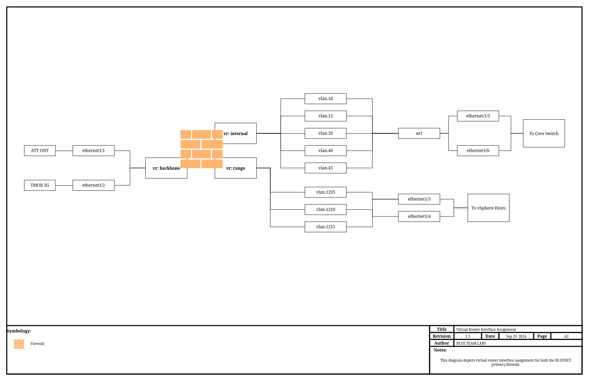

# Network Security
I was originally going to name this just "Edge Security", but after thinking about it briefly, its more in-depth than that due to how it is configured. It is more than simply controlling network access at the edge, we also segment the network and control flow in between different VLANs/subnets.

## Devices
Edge security is provided by Palo Alto Networks NGFW. This is actually a remnant of a previous job I had, where I was responsible for designing, deploying, and maintaining a greenfield deployment of PANW firewalls. While working there, I invested in a PANW PA-440-LAB device for my homelab, and have maintained the licenses ever since.

| Manufacturer | Model | Hostname | Interfaces |
| ------------ | ----- | -------- | --------- |
| PANW | PA-440-LAB | gwof.core.blueteamlabs.io | 8 x Gbe |

## Performance Capabilities

The PA-440 is one of the entry level devices for PANW, despite this it offers competitive throughput for the price point, and when compared to other vendors at the same price point and featureset, stands out as a leader.

| Metric | Value |
| ------ | ----- |
| Firewall Throughput | 2.9/2.2Gbps | 
| Threat Prevention Throughput | 0.9/1.0 Gbps |
| IPSec VPN Throughput | 1.7 Gbps | 
| Max Sessions | 200,000 | 
| Max Sessions per Second | 37,000 |

Full details are available via the [PA-400 Series Datasheet](https://www.paloaltonetworks.com/apps/pan/public/downloadResource?pagePath=/content/pan/en_US/resources/datasheets/pa-400-series-pan-os-10-2)

## Licenses
Licenses for the LAB SKU of PANW devices are generally all encompassing, meaning that you get the full "enterprise" suite of licenses, which is extremely helpful for training with real-world features and complexity.

The LAB SKU provides the following licenses:

| Name | Description |
| ---- | ----------- |
| Advanced DNS Security | Adv DNS Sec Sub |
| Advanced URL Filtering | Adv URL Filtering Sub |
| DNS Security | Std DNS Sec Sub | 
| SD WAN | License to enable SD-WAN | 
| Threat Prevention | Std Threat Prev Sub |
| WildFire License | Std WildFire Sub | 
| Advanced Threat Protection | Adv Threat Prot Sub |
| Advanced WildFire License | Access to Advanced WildFire signatures, logs, API | 
| GlobalProtect Gateway | GlobalProtect Gateway License | 
| PAN-DB URL Filtering | Palo Alto Networks URL Filtering License |
| Standard | 10 x 5 phone support; repair and replace hardware service |
 
!!! Info "Disclaimer on LAB SKUs and Obtaining PANW Devices"
    In order to obtain any PANW device, you must have a registered business for which you are buying the device for. PANW does not let individuals purchase devices, software, or licenses. I do happen to do some consulting on the side, which I have a registered business for.   
    If you often work with PANW devices, it would be worth speaking with your sales rep to see if they can comp your org a LAB SKU device to have around as a sandbox. I have been able to obtain this at previous employers through VARs. Keep in mind if you are able to do this, the device would belong to your organization, and not you personally.  
    Lab SKU devices are intended only for labs, and using them in a production environment is a violation of PANWs ToS, and will get your subscriptions terminated along with potential legal actions.

## Architecture
The design of this network is intended to provide full scope visibility and control between segmented VLANS and subnets. While it does not nesecarilly provide full scope visibility into intra-VLAN/intra-subnet traffic, it has full visibility and control of traffic passing to other networks.

This is accomplished using what some of you in the network world may know as "router on a stick", except in this situation, it's "firewall on a stick". The trunk link(s) to the core switch act as the default gateway for those subnets, ensuring that traffic must be routed through the firewall. 

The above diagram depicts, as best possible, how the "firewall on a stick" is configured. As you can see, the VLANs are assigned on the firewall with an IP address that devices use as their default gateway. These interfaces are then created as sub interfaces for all interfaces that have devices connecting to these VLANs. This diagram also depicts something we'll go into later on, virtual routers.

## Interface Assignments

### Physical Interfaces

| Interface Name | Type | Description | Tags |
| -------------- | ---- | ----------- | ---- |
| ethernet1/1 | Layer3 | Link to ATT ONT | N/A |
| ethernet1/2 | Layer3 | Link to TMobile 5G | N/A |
| ethernet1/3 | Layer2 | Link to virt01 | N/A | 
| ethernet1/3.1205 | Layer2 | VLAN1205 Subinterface | Vlan1205 |
| ethernet1/3.1210 | Layer2 | VLAN1210 Subinterface | Vlan1210 |
| ethernet1/3.1215 | Layer2 | VLAN1210 Subinterface | Vlan1215 |
| ethernet1/4 | Layer2 | Link to virt02 | N/A |
| ethernet1/4.1205 | Layer2 | VLAN1205 Subinterface | Vlan1205 |
| ethernet1/4.1210 | Layer2 | VLAN1210 Subinterface | Vlan1210 |
| ethernet1/4.1215 | Layer2 | VLAN1210 Subinterface | Vlan1215 |
| ethernet1/5 | Aggregate Member | AE Member to Core Switch | N/A |
| ethernet1/6 | Aggregate Member | AE Member to Core Switch | N/A |
| ethernet1/7 | Disabled | Unused | N/A |
| ethernet1/8 | Layer2 | Link to Mgmt Port | Vlan12 |
| ae1 | Layer2 | Agg Link to Core Switch | N/A |
| ae1.10 | Layer2 | VLAN10 Subinterface | Vlan10 |
| ae1.12 | Layer2 | VLAN12 Subinterface | Vlan12 |
| ae1.20 | Layer2 | VLAN20 Subinterface | Vlan20 |
| ae1.40 | Layer2 | VLAN40 Subinterface | Vlan40 |
| ae1.45 | Layer2 | VLAN45 Subinterface | Vlan45 |

### VLAN Interfaces

| Interface Name | Type | Description | VLAN |
| -------------- | ---- | ----------- | ---- |
| vlan.10 | Layer3 | Server VLAN | SrvVlan |
| vlan.12 | Layer3 | Management VLAN | MgmtVlan |
| vlan.20 | Layer3 | User VLAN | UserVlan | 
| vlan.40 | Layer3 | Guestnet VLAN | GuestVlan |
| vlan.45 | Layer3 | IoT VLAN | IoTVlan |
| vlan.1205 | Layer3 | DMZ VLAN | DmzVlan |
| vlan.1210 | Layer3 | Sandbox VLAN | SandboxVlan |
| vlan.1215 | Layer3 | Range VLAN | RangeVlan |

There are also Loopback, Tunnel, and SD-WAN interfaces. However, these are not currently configured.

## Virtual Routers
Virtual routers can be used to implement logical separation. In Cisco-networking, we used to (been awhile) call these Virtual Route Forward (VRF) instances. They separate routing and forwarding tables, enabling great segmentation and allowing for the use of overlapping IP space. 

We currently utilize 3 Virtual Routers

| Name | Use |
| ---- | --- |
| internal | VR for internal servers, mgmt, users, etc | 
| range | VR for sandbox, DMZ, and range subnets |
| backbone | VR for internet connections |

[https://docs.paloaltonetworks.com/pan-os/10-1/pan-os-networking-admin/virtual-routers/virtual-router-overview](https://docs.paloaltonetworks.com/pan-os/10-1/pan-os-networking-admin/virtual-routers/virtual-router-overview)

We specifically utilize them for a few purposes:

* Automatic failover of internet connections using PBR and "next-vr" routing.
* Segmentation of sandbox and trusted subnets using "drop" routing for subnets.
* Simplifying route management

### Internal VR Routes
| Route | Action | Next Hop | Desc | 
| ----- | ------ | -------- | ---- | 
| 172.16.120.0/24 | next-vr | sandbox | DMZ | 
| 172.16.0.0/12 | drop | N/A | Drop Sandbox | 
| 192.168.0.0/16 | drop | N/A | Drop Unused |
| 0.0.0.0/0 | next-vr | backbone | Internet |

### Sandbox VR Routes

| Route | Action | Next Hop | Desc |
| ----- | ------ | -------- | ---- |
| 10.13.37.0/27 | next-vr | internal | Servers |
| 10.0.0.0/8 | drop | N/A | Drop Internal |
| 192.168.0.0/16 | drop | N/A | Drop Unused |
| 0.0.0.0/0 | next-vr | backbone | Internet |

### Backbone VR Routes
| Route | Action | Next Hop | Desc |
| ----- | ------ | -------- | ---- |
| 172.16.0.0/12 | next-vr | sandbox | Sandbox and DMZ |
| 10.0.0.0/8 | next-vr | internal | Internal |

!!! Question "No Default Route"
    You'll notice that theres no default route in the backbone VR. This is due to us using Policy Based Forwarding (PBF), which allows us to configure path monitoring and pre-emption for automated and fast failover when one connection goes down. We'll cover this more in depth in a separate section.

## Security Zones

### Zone Protection Profiles

## Basic Objects
### External Dynamic Lists
There are several External Dynamic Lists (EDLs) in use. EDLs are essentially text files containing a list of entries that can be dynamically refreshed by the firewall, without the need to commit. This enables us to manage a list of dynamic addresses knowing they'll be automatically updated on the firewall without our intervention. Refresh intervals can be selected, ranging from 5-minutes to daily or weekly.

| Name | Link | Certificate Profile | Usage | Refresh Interval | Type | 
| ----- | ------ | -------- | ---- | ---- | ---- |
| IoC Domains - BTL Gitlab Hosted EDL | something | CertProf-BTL-Chain | BTL Managed list of IoCs to be blocked explicitly | Every 5-minutes | Dynamic Domain List |
| IoC IPv4 - BTL Gitlab Hosted EDL | something | CertProf-BTL-Chain | BTL Managed list of IoCs to be blocked explicitly | Every 5-minutes | Dynamic IP List |
| IoC URLs - BTL Gitlab Hosted EDL | something | CertProf-BTL-Chain | BTL Managed list of IoCs to belocked explicitly | Every 5-minutes | Dynamic URL List |
| Microsoft 365 GCC - PANW Hosted EDL | https://saasedl.paloaltonetworks.com/feeds/m365/usgovgcchigh/any/all/ipv4 | CertProf-Google-Trust-Chain |  bUsed to exempt GCC MS traffic from Decryption for Work | Daily at 00:00 | Dynamic IP List |
| Microsoft Azure GCC - PANW Hosted EDL | https://saasedl.paloaltonetworks.com/feeds/azure/usgov/any/ipv4 | CertProf-Google-Trust-Chain | Used to exempt GCC MS traffic from Decryption for Work | Daily at 00:00 |Dynamic IP List |
| Proton Services - BTL Gihub Hosted EDL | https://raw.githubusercontent.com/blueteamboss/pan-edls/main/proton_AG-proton-mail-vpn-cal-etc | CertProf-Google-Trust-Chain | Used to exempt Proton Mail and related from decryption | Daily at 00:00 | Dynamic IP List |

EDLs can be managed by going ton "Objects" --> "External Dynamic Lists" and include types for:

* URLs
* Domains (FQDNs)
* IPv4 Addresses
* IPv6 Addresses

One of the great things is that we can use Github, Gitlab, or whatever git service of our choice, which enables us to track changes and versioning just like we would want to do with code.

### Address Objects and Groups
This section is not comprehensive and is intended too provide what the most important ones are used for.

### Application Objects, Groups, and Filters
This section is not comprehensive and is intended too provide what the most important ones are used for.

### Tags
This section is not comprehensive and is intended too provide what the most important ones are used for.

## Security Profiles and Groups
Security profiles are how we enable or disable threat protection profiles on a specific traffic flow. When we create Security Profiles, we can create groups so that our preferred settings are all stored in a central group that we can select instead of selecting them each individually.

These groups are enabled per-security rule, which is useful in reducing overhead on specific traffic. For instance, a rule that explicitly denies traffic, wouldn't need a security profile for vulnerabilities, as the traffic is denied anyway. Security profiles can also help us gather packet captures for suspicious traffic, send alerts, and drop malicious activity.

### Antivirus Profiles
### Anti-spyware Profiles
### Vulnerability Protection Profiles
### URL Filtering Profiles
### File Blocking Profiles
### Wildfire Analysis Profiles
### Data Filtering Profiles
### DOS Protection Profiles

## Authentication Profiles

## Log Forwarding Profiles

## Decryption Profiles

## Application Filters
