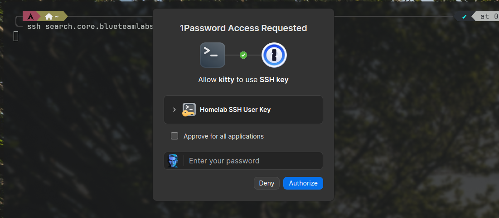
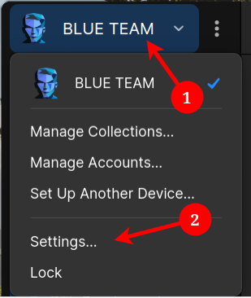
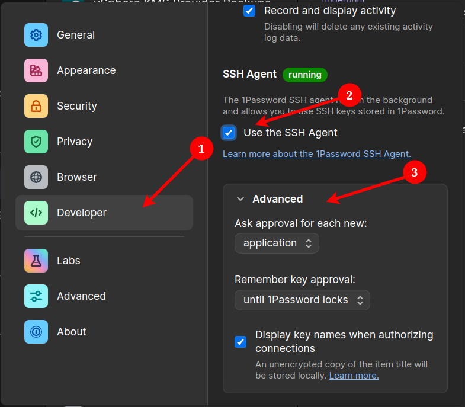

# Using the 1Password SSH Agent
I've been an avid user of password managers since the early days of KeePass. While I'll leave it another thoughts post to cover why I use 1Password in specific, one of my favorite features has to be 1Passwords SSH agent.

Using the SSH agent takes the fear of unsecured SSH keys left on my desktop out of mind and walls them off behind the 1Password agent, requiring my master password for use. It allows for importing of specific keys, using them for Git signing, and is fairly simple to setup.

<!-- more -->
## What is an SSH Agent?
It's a key-manager. Rather than having to enter a password for an SSH key every single time you use it, which could be cumbersome if you're a developer constantly pushing to Github or a systems admin constantly remoting into different servers. Agents are important so that:

* Keys aren't written to disk
* Keys can't be exported

That's it. Fairly simple. They all work the same, with minor differences in behavior. 

## 1Password SSH Agent
The 1Password SSH agent is great because rather than having to remember individual key passwords, or worse, having them all be the same, it utilizes my master password. That's right folks, I only remember about 3 passwords off the top of my head.

* One to login to my desktop
* One for work (which I often forget and have to reference 1Password for lol)
* One for 1Password

The rest, including SSH key passwords, are stored in a password manager.

Back when I had a Mac for work, the 1Password agent was actually pretty based. It allowed me too use Touch ID so I didn't even have to enter my master password often. 

{width=600}
/// caption
To demonstrate exactly how this works, I'll just SSH into my SearXNG server real quick.
///

#### What it's doing
Something that may cause problems, so this is important to know, is how 1Password selects the key.

Simple. It tries them all.

Very similar too all other SSH agents.

This may cause problems depending on the SSH servers configuration. I had too adjust my sshd_config to account for this. This is due to it hitting the `MaxAuthTries` limit.

##### `/etc/ssh/sshd_config.d/05-authentication.conf`
```
PermitRootLogin no
PasswordAuthentication no
AuthenticationMethods publickey
PubkeyAuthentication yes
ChallengeResponseAuthentication yes
KbdInteractiveAuthentication yes
MaxAuthTries 5

```
The value you require for `MaxAuthTries` is dependent on how many keys you're using with the agent. For instance, if you're importing all of your keys, you'll need a higher limit.

In other situations, you may want to match this based on the public key. This can be configured by setting the `IdentityFile` for the host in you `~/.ssh/config` file to the file pointing to the public key.

For instance, here's how I have mine set for GitHub
##### `~/.ssh/config`
```
Host github.com
	User git
	IdentityFile ~/.ssh/github_id_ed25519.pub
	IdentitiesOnly yes
```

## How to Set it Up
Setting it up is fairly simple. As long as you have 1Password installed, getting the agent setup is a breeze.

{width=400}
/// caption
In the 1Password desktop app, click the account name in the top left hand corner and go to **"Settings"**
///


{width=400}
/// caption
Next, go to **"Developer"**, scroll to the **"SSH Agent"** section and check the box for **"Use the SSH Agent"**. Optionally set any of the advanced settings to your liking.
///

Next, you'll need to create a file called in your 1Password config directory called `agent.toml`. On Linux this is in `~/.config/1Password/ssh/agent.toml`

In the agent.toml file, you'll tell 1Password which keys it can use. These keys must already be uploaded to your 1Password vault. 

The format is pretty simple

You tell it a key by the delimiter `[[ssh-keys]]` followed by `item` which is the name or unique ID of the item in 1Password, `vault` which is the vault name that it's stored in, and `account` which is the account name it's stored in; useful if you use a work and personal 1Password accouont on the same device.

Here's an excerpt from mine to demonstrate that.

##### `~/.config/1Password/ssh/agent.toml`
```
[[ssh-keys]]
item = "Homelab SSH User Key"
vault = "BTL Cryptography"
account = "BLUE TEAM"

[[ssh-keys]]
item = "Github BTL SSH Key"
vault = "BTL Cryptography"
account = "BLUE TEAM"
```

After you've done that, you'll need to modify your SSH config to tell it to use the 1Password agent. This is fairly simple. You can do this blanket, or staged if you need to. 

To do this, just set `IdentityAgent ~/.1password/agent.sock` in the config file under the hosts you want to use the SSH agent. You can combine it with the public key file if you need to get around the `MaxAuthTries` we mentioned earlier, and maybe the `User` if the remote username is different than the one you're logged in as.

##### `~/.ssh/config`
```
Host *
	IdentityAgent ~/.1password/agent.sock

Host github.com
	User git
	IdentityFile ~/.ssh/github_id_ed25519.pub
	IdentitiesOnly yes

```

Next, go ahead and try to SSH into something. You should get the 1Password prompt. If not, you did something wrong or something is unique on your system that needs to be modified. If you're on Windows, sorry you'll have to find the instructions on your own. I do have it setup on Windows but don't feel like digging that up for y'all.

## Closing
SSH Agents are a lifesaver, and even better are ones that completely remove even the encrypted private key from disk. If you're a power user or developer and have a 1Password account, go ahead and get started with the 1Password Agent. You'll thank yourself for it 1-million times over.