# Creating Custom App-IDs - Proxmox
If you've ever administered a firewall with advanced inspection features, you're probably all too familiar with specific applications being decoded as basic ones like SSL or Web browsing. This highlights the complex relationship we as administrators have with nearly all internet-traffic being encrypted. While we're happy we've adopted encryption, it also thwarts some of our inspection capabilities. 

Thankfully, we're an enterprise, and we've gone ahead and setup SSL decryption. Now 80% of our traffic is decoded properly and inspected with appropriate security filters. What about the other 20%?

The world is less than perfect, which means that companies like Palo Alto, Fortinet, Cisco, and others can't create app-decoders for every application out there. Some are sparingly used, custom, or just don't have anything unique to identify them with. Fear not though, for we have the power. The power to create custom App-IDs.
<!-- more -->
## The Objective
This is a series on custom App-IDs, and how to create them. In this episode, we cover my utilization of Custom App-IDs to decode Proxmox traffic. I recently switched to Proxmox after Broadcom, in their infinite wisdom, began gatekeeping access to eval experience licenses for VMWare User Group members. Previously, I could get 365-day eval licenses for the full VMWare suite, which was fantastic for labbing things out and learning. In their never ending quest to expand profits though, VMWare locked this behind certifications. That's right, in order to learn how to administer their platforms, you have to get a certification to get access to their platform to learn it. 

That's okay, Proxmox has come a long way.

## Working with Proxmox
Similar to VMWare, Proxmox is administered via a web-interface. Proxmox is built on Linux, Debian to be specific, and looks like any generic web application. Palo Alto does not have app decoders yet, though I'm confident they will in the near future as enterprises look to alternatives for VMWare given the rumblings 2-3x price increases even for the largest of consumers.

Proxmox uses the following ports for web access:

* `tcp/8006` - SSL Encrypted Web Traffic
* `tcp/5000-5999` - Websockets (VNC Web Console)

## Determining how to Match Traffic
Okay, so we know how to access our Proxmox server, but what makes it uniquely identifiable as Proxmox traffic itself. Certainly, we could match based off of domains or request URIs, but that's not easily portable to new deployments of Proxmox. If we create a decoder specific to Server Name Identifiers (SNI) or request URIs, we'd have to update that every-time we provision a new Proxmox server. We don't want that. We want it to be able to decode the traffic regardless of the SNI, Domain, or  URI. We want anyone to be able to pick this app decoder up, import it into their firewall, and have it properly decode traffic as Proxmox.


For this, we're going to need to take a look at:

* HTTP Request Headers
* HTTP Response Headers
* Websockets Request Contexts

Now, we're not always going to be able to decode traffic using these. Sometimes, there won't be any unique headers or contexts, which might prevent us from decoding altoghether unless we do it based on something like SNI, Domain, or URI. While the later might be okay for SaaS applications whose resources are well known, it doesn't for something like Proxmox.

## Inspecting the Traffic - Zed Attack Proxy
For this, we're going to be using Zed Attack Proxy (zaproxy) for interecepting the web traffic and inspecting the headers. While we could use our browsers developer console, Wireshark, HAR logs, or other tools, I personally find ZAP easier to navigate and find what I need to within seconds.


/// caption
```btw, i use arch.```
///


I'll be installing this via the 'extra' repo on Arch:
```bash
sudo pacman -Sy zaproxy
```

If you're using a lesser distro, you can find out how to install ZAP on your distro below, or alternatively install Arch and be part of the meme:

* [ZAP Install Guides](https://software.opensuse.org/download.html?project=home%3Acabelo&package=zap)
* [Install Arch](https://wiki.archlinux.org/title/Installation_guide)

### Setting up the Browser
With ZAP installed, go ahead and run it. This can usually be done by just opening a terminal and running `#!bash-inline zaproxy`. ZAP is unfortunately an Java application, but despite the slowness and my hate for Java we will push through.

The first thing you'll want to do is go over to your browser and visit the local ZAP proxy to download the CA. This is optional, but prevents us from getting certificate warnings when we're working with Proxmox. That is assuming you've already installed a certificate from a trusted issuer on Proxmox. 

After we do that, we'll have to change the proxy settings in our browser. For this demonstration, I'm using Firefox--it's easier to work with Proxies on and can do so independently of system proxy settings.


#### Installing ZAP CA (Optional)
In your web browser, visit `localhost:8080`, this is the default port for ZAP. This will open a page where you can download the CA Certificate and install it into your browsers trusted store.

???+warning "Optional"
    This section for installing the ZAP CA in our browsers trusted store is completely optional. If you're okay with dealing with browser warnings, skip ahead to [Configuring Proxy Settings](#configuring-proxy-settings)

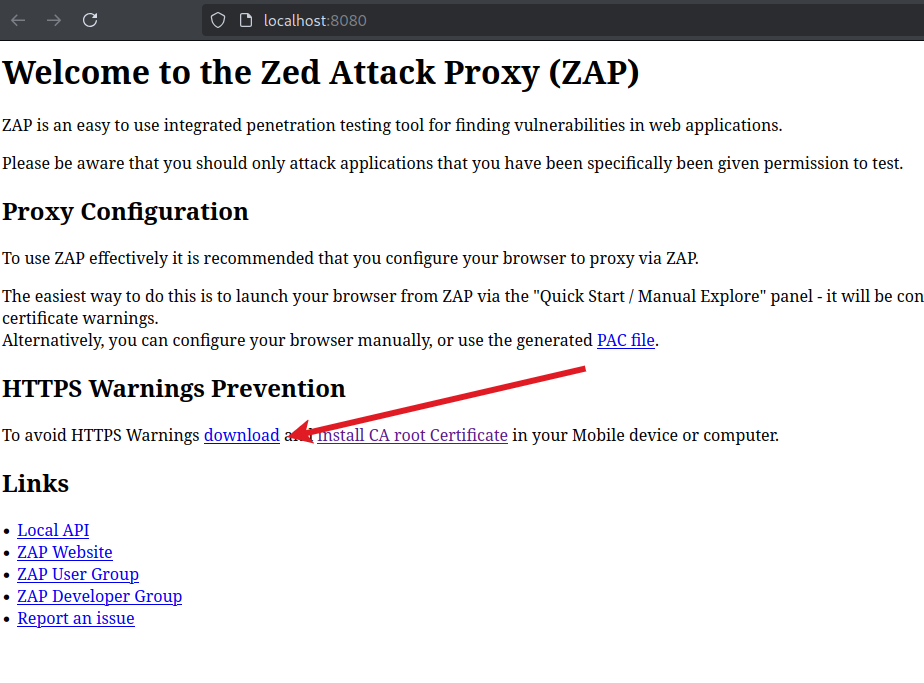
/// caption
To download the CA certificate, click the link for **"download"**.
///

Next, we'll need to head over to our browsers trust chain manager and import this certificate. 

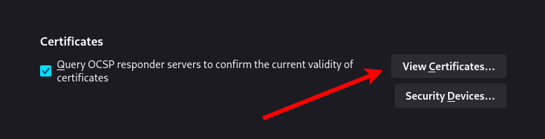{ width=600 }
/// caption
Go to `about:settings#privacy` in your URL bar and scroll down until you see the **"Certificates"** section. Here, click **"View Certificates"** to open up the dialog for importing CA chains.

///

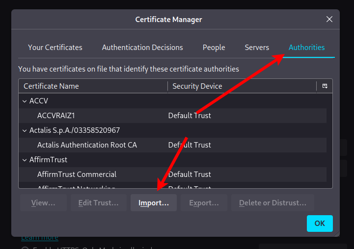{ width=600 }
/// caption
Next, go to the "Authorities" tab and click the **"Import"** button.
///

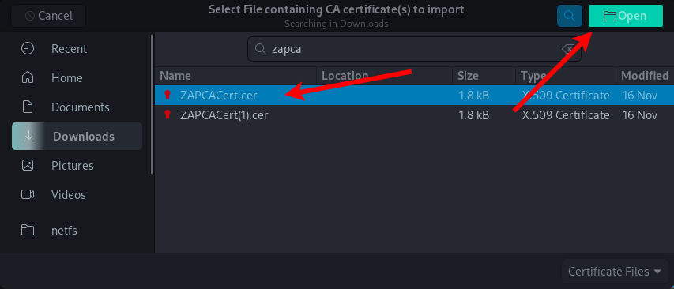{ width=600 }
/// caption
You'll be met with a normal file dialog. Locate the certificate we downloaded earlier and click open.
///

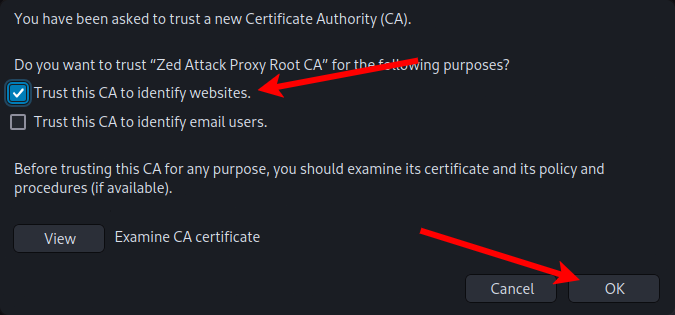{ width=600 }
/// caption
In the pop-up, select **"Trust this CA to identify websites"** and click **"OK"**. This just determines what Firefox allows this CA to be used for.
///

#### Configuring Proxy Settings


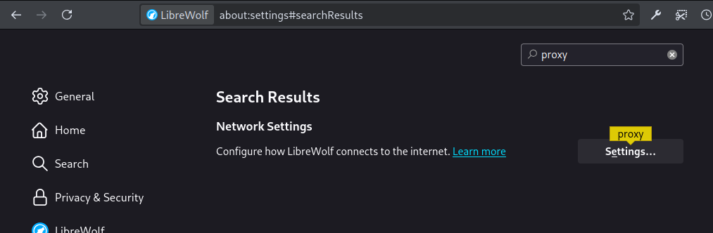{ width="600"}
/// caption
Navigate to `about:setting` in our web browser. Search for "Proxy" in the search bar. Open the "settings" button.
///

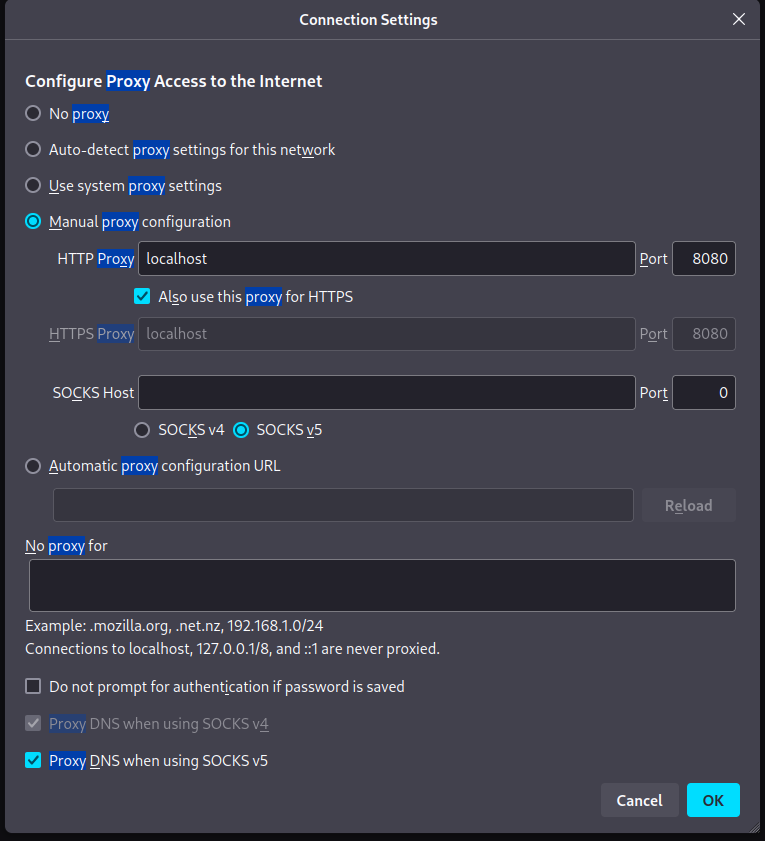{ width="600"}
/// caption
In the dialog, select **"Manual Proxy Configuration"** and enter **"localhost"** in the HTTP Proxy field, with the port **"8080"**. Next, select **"Also use this proxy for HTTPS"**. Click **"OK"** to close
///

### Visiting our Proxmox Server
Next up, we'll want to visit our Proxmox server. This is obviously self explanatory. This also doesn't have to be Proxmox you're visiting, just something you're looking to build a decoder for or learn more about what the traffic looks like under the hood.


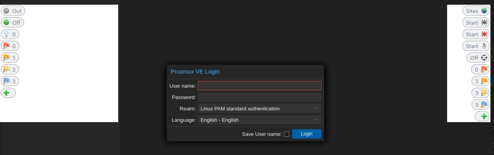{ width=600 }
/// caption
For this, I'll be visiting one of four servers in my Proxmox cluster, `https://virt02.core.blueteamlabs.io:8006`.
///

???note "What are those elements"
    This is a beautiful feature of ZAP, where it allows you to interact directly within the browser and learn about some of the interesting alerts it's already identified (things like information disclosure alerts and more). We won't be using this.

Before logging in, I want to go over to my ZAP GUI and take a look at things now that the web-page has loaded.

First, let's expand the **"Sites"** section, and locate the first request. Here we'll see an HTTP GET request for `:/`. This will be pretty common. 

Click on the `GET:/` entry and head over to the **"Response"** tab. For those unfamiliar with HTTP responses, once a client has requested a resource, the server responds with information like headers, status codes, server data, and security information. 

When we're looking at the response, we're focused on headers. While we technically can inspect the actually payload (e.g. body), we should avoid this unless absolutely neseccary. Although PANW has good performance due to it's single-pass filtering, it can induce latency if we're inspecting millions of packets to extract a specific value from within the response payload. Headers are more efficient, as long as they're unique enough.

In the headers we'll be looking for a couple of interesting things.

* The `server` header
* Any interesting entries in the `Access-Control-Allow-Headers` 
* Any custom headers specific to that application (e.g. `X-<app-name>`)

Depending on the application and what headers it provides, there's endless options for us to go off of. In most of those scenarios, you'd only know by taking a look at the headers. To be clear, in most web-browsers this is already accessible and can be accessed without ZAP, but ZAP just makes it easier to find.

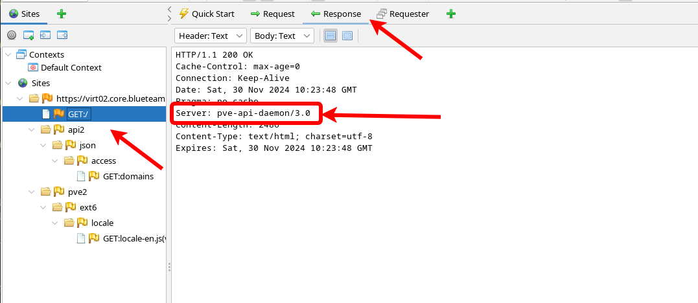{ width=700 }
/// caption
Reviewing the response headers from our `GET:/` request, we can see something interesting already. The `server` header is reported as `pve-api-daemon/3.0`. This is good, we can already uniquely identify this without going too much further.
///

Quickly reviewing some of the other `GET` requests for different paths on the Proxmox server, we can see this header is consistently used and is something we can rely on.

???success "Recap"
    We were able to extract a response header we can use to identify this traffic, that being the `Server: pve-api-daemon/3.0` value.

    Additionally, we know that Proxmox web traffic occurs over `tcp/8006`. Since we are looking at response headers for an encrypted session, we also know we'll need to decrypt this traffic. This is important. 

## An Alternative: Wireshark
Maybe you're a packet junky and prefer analyzing traffic in Wireshark. This is relatively simple. To do this we just need to set an environmental variable and launch our Web Browser. Once we've got that done we can visit the page while capturing the traffic in Wireshark.

On Linux, set the `SSLKEYLOGFILE` in your shell profile (.bash_profile, .zshrc, etc). The pre-master secrets we need to decrypt the traffic will be logged to this file. Due to some oddities in my system, even though I'm using zsh as my main shell, I still need this set in my .bashrc file.

???+danger
    I would highly recommend deleting this log file (perhaps wiping it multiple times over) and removing this from your .bashrc when you're done. Anyone whose intercepted your traffic and stored it to decrypt later could potentially abuse this log file.

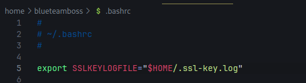{ width=600 }

/// caption
Set the environmental variable by adding it to your shell init script or setting it for your current session
```bash
export SSLKEYLOGFILE="$HOME/.ssl-key.log"
```
///


This is the same environmental variable in Windows, so you can go ahead and set it up via the GUI in Windows if you're into that sort of thing.

Next, we'll open up a two new terminal sessions, verify the environmental variable is set properly, and launch our web-browser of choice and monitor the log file to ensure entries are being added when we visit a web-page.
???+note
    At this point you need to Open wireshark and start listening for traffic if you haven't already. For the purposes of this demo, I've already launched Wireshark and am capturing traffic.

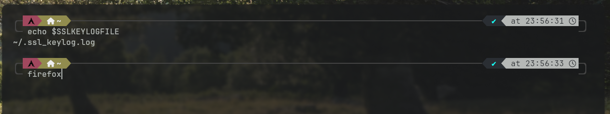{ width=600 }
/// caption
In the first terminal window, echo out the variable we set to make sure it's set correctly, then launch your web-browser if everything checks out.
```bash
echo $SSLKEYLOGFILE
```
///

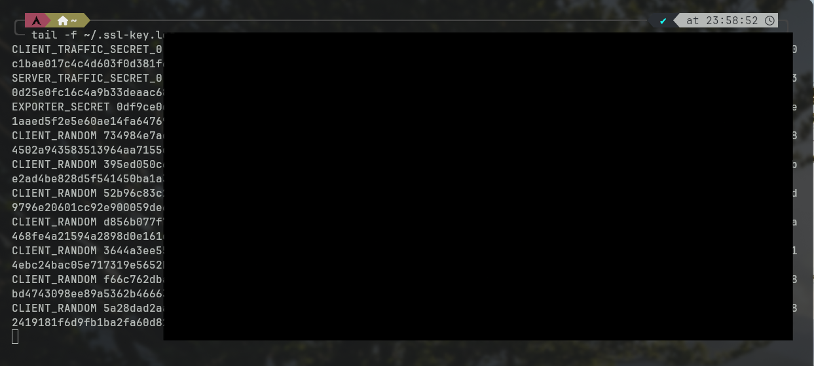{ width=600 }
/// caption
In the second terminal window, tail the log file to ensure it's populating properly after visiting a site. Chances are your web-browser communicated to some telemetry sites automatically and has already logged those secrets.
```bash
tail -f $SSLKEYLOGFILE'
```
///

Next, go to the **"Edit"** menu in Wireshark, and select **"Edit Preferences"**. You can alternatively press ++ctrl+shift+p++

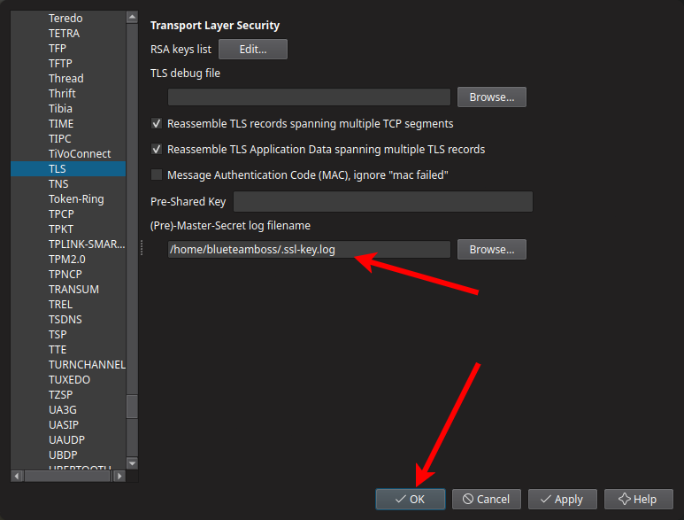{ width=600 }
/// caption
Navigate to **"Protocols"** and scroll all the way down to **"TLS"**. Not the most user friendly, but let's just be glad something like Wireshark is free and exists.

In the "(Pre)-Master-Secret log filename" field, enter the path to the log file we set earlier.
///

???+success "Happy Hunting!"
    And just like that, you should start seeing TLS traffic being analyzed as "HTTP" once the handshake is complete. Happy hunting, you'll find everything we did with ZAP.
    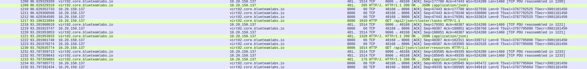{ width =600}


## What about the Web-based VNC Console traffic?
While I did initially look down this path, and did have some minor success, I wasn't able to consistently decode the console traffic, and therefore will skip it in this post. I did spend way more time than I'm comfortable admitting, only for it not to work. Such is life.

## Creating the "proxmox-base" App-ID
Okay, so we've got everything we need to identify the traffic, now we need to create the App-ID.

???+note
    This section assumes we've already got Decryption in place between our workstation and the Proxmox servers on tcp/8006. That's a simple thing to do, and I won't go into it here to keep this shorter.

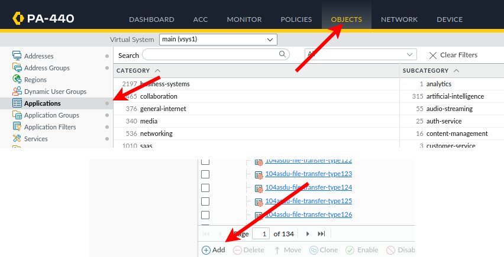{ width=600 align=left }
/// caption
On our Palo, we'll head over to the "Objects" tab and go to "Application". Click "Add".
/// 

 We will be creating the "proxmox-base" App-ID, this will match the general web traffic for administering the Proxmox cluster.

#### "Configuration" Tab Options
|  |  |
| ------------- | ----- |
| **Name**          | proxmox-base |
| **Description**   | Proxmox Virtual Environment (Proxmox VE or PVE) is a virtualization platform designed for the provisioning of hyper-converged infrastructure. |
| **Category**      | networking   |
| **Subcategory**   | it-infrastructure |
| **Technology**    | browser-based |


Under the "Characteristics" section, we'll select the following:

* Capable of File Transfer
* Excessive Bandwidth Use
* Continue scanning for other applications

???+note
    ~~The last item there is important since our intent is to create secondary App-IDs to match the VNC web console. This enables us to do that, and does exactly what it sounds like.~~

    This would have been important, but I still haven't got the App-ID for proxmox-web-vnc working reliably. It'll probably come to me in a eureka moment as I'm struggling to fall asleep after staring at the ceiling for the past 4-hours.

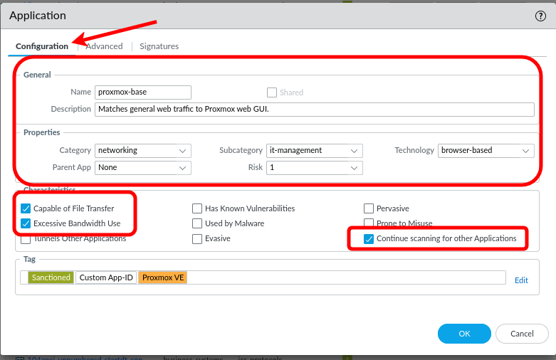{ width=600 }
/// caption
First, enter all the values in the "Configuration" tab. When that's done, head on over to the "Advanced" tab.
///

#### "Advanced" Tap Options
For our configurations here, we're going to set the default port that Proxmox web traffic uses. This is simple, `tcp/8006`.

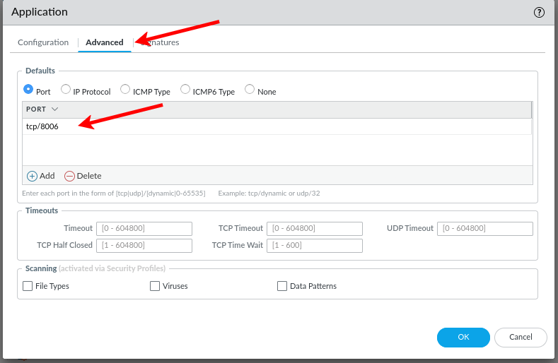{ width=600 }
/// caption
Under "Defaults", select "Port" and add the entry `tcp/8006`. When done, meander over to the "Signatures" tab.
///

#### "Signatures" Tab Options
Everything up to this point was pretty self explanatory. Thankfully, I never personally guaranteed this would always be the case.

Signatures are how we actually match request, response, and payload patterns or values. We can have multiple signatures per App-ID, which might be used to delineate different versions or highly complex signatures that have multiple logical requirements best separated out.

Click the "Add" button to add a new Signature. We'll be calling ours "proxmox-http-rsp-head". Under the comment, put whatever floats your boat. I put "Matches the response header for Server: pve-api-daemon/3.0".

{ width=600 }
/// caption
I'd like to just interject for a moment. What you're referring to as PAN, is actual PANW, or as Nir would like us to call them, Palo Alto Networks
///


##### Scope - Transaction vs Session
When we set our scope to "Transaction", we're matching each singular transaction. This is useful when we want to match specific actions within an application that might be distinct. For instance, say we wanted to match youtube-uploading as one application, and youtube-base as another.

When set to "Session", it matches behavior across the entire session. This is useful when we can't uniquely identify an application based off of one transaction. This might be applications that require a full handshake to complete, along with multiple messages to be sent back and forth.

##### Ordered Condition Match
This is relatively easy to understand, if set, this requires that traffic match in the specific order configured in. For instance if you require a specific request URI and a specific header or payload value, they would match in the order you put them in. If disable, it matches in any order.

##### AND vs OR Conditions
If we create an OR condition, then we only need to match one of the entries in the OR condition. For instance if you say the traffic must match "video.youtube.com" OR have a header of "Server: gts", if either of those is true, the signature will return true.

For an AND condition, it would require that all conditions within that AND condition match.

###
For our use case, we're going to leave these at "Transaction" for Scope and "Ordered Condition Match" set to enabled. Since we really only need to look for one value thanks to Proxmox persisting the correct server header across responses, we don't need anything too advanced at the moment.

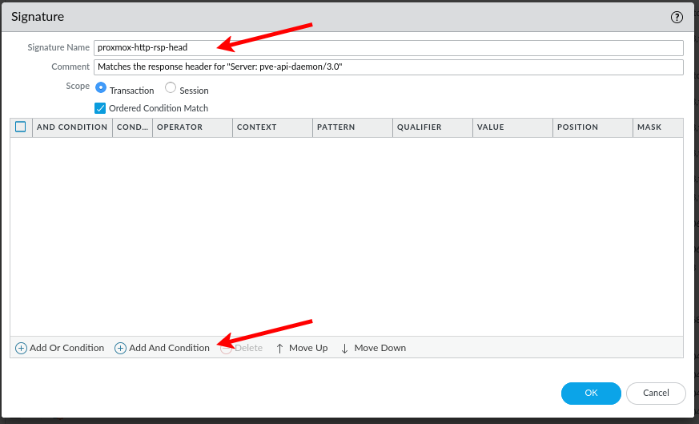{ width=600 }
/// caption
Enter the Name and comment, and click "Add And Condition".
///

For us, we're going to use "Pattern Match" as the operator, which would allow us to match regular expressions and strings. If we had an integer value we were looking for, we could use less-than, greater-than, or equal-to.

For context, we'll be using the "http-rsp-headers"

For the pattern, we can use one of the following patterns:
```
Server: pve-api-daemon/3.0 

Server: pve-api-daemon/(\d+\.\d+)
```
I'm electing to use the regex pattern, as this will allow us to account for future updates to Proxmox that might change the API version.

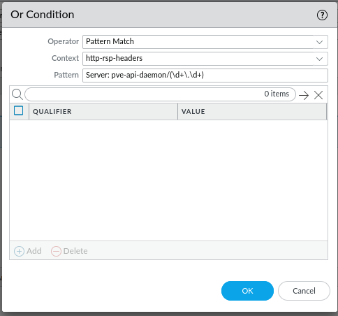{ width=600 }
/// caption
Set **"Operator"** to **"Pattern Match"**

**"Context"** to **"http-rsp-headers"**

**"Pattern"** to `Server: pve-api-daemon/(\d+\.\d+)` 

Click **"OK"**.
///

Click **"OK"** again to close the application signature. Next, click **"OK"** again to close the application object we're creating. Finally, click **"Commit"**

???note "Seriously, PANW?"
    Okay, I've got a bone to pick. While I still love PANW appliances, I cannot stand how many buttons you have to click in the interface, and it's just as bad to use the CLI where you have to continue question-mark or tab things because I don't have a perfect memory. Please make this simpler. Stop with the pop-ups and separate dialogs. Find a better way.

## Testing the App-ID
Now, that we've got our changes committed, let's head on over to the "Monitor" tab and see if we can see our new App-ID in action when we visit Proxmox.

???+success
    By searching for traffic to our PVE server, we can see that prior to this change, the app was being seen as "web-browsing", but now that the change has been committed, it's being seen as "proxmox-base". For once I did something right.
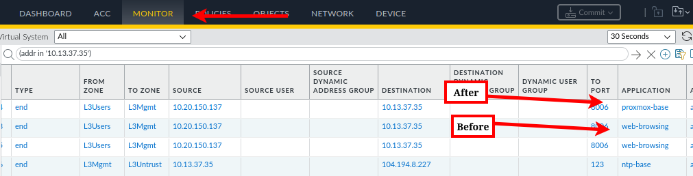
## Conclusion
There's alot we can do with App-IDs, to simply monitoring what applications are actually traversing our network, to enabling advanced inspection like data patterns, viruses, and file types. They're a preferable alternative to Application Overrides, and are sometimes neseccary. 

In my experience, Custom App-IDs are used sparingly. That's mostly because everyone sees the effort involved in decrypting traffic and says no thanks. I don't blame them, it's a constant headache. PANW is also very good about adding new decoders periodically, and tests them heavily before deployment--though CrowdStrike said the same thing before we all got CrowdStruck. 

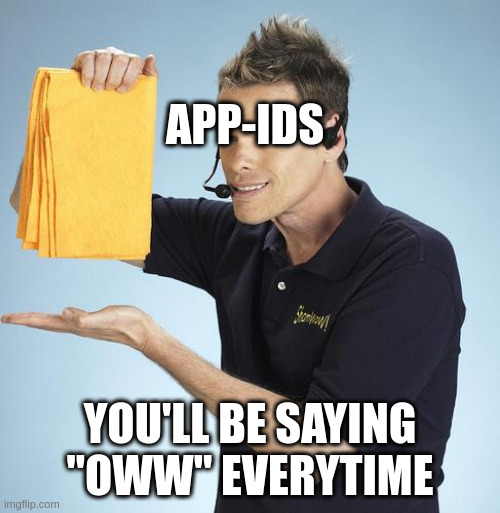{ width=600 }
///caption
///