# Forwarding iDRAC Logs to Splunk with syslog-ng
I'm a firm believer in centralized logging of everything. If it supports sending some sort of log stream to a remote location, it should be getting sent there. In my case, my lab utilizes Splunk through the developer license.

As of today, all of my logs for Windows, Linux, Firewalls, Duo, and a few other random things are in Splunk. 

I actually realized I wasn't forwarding the logs when I went to update my iDRAC controller and BIOS firmware. It's been a while since I did that, so while I was in there I was validating all my other settings were as expected and realized syslog was not configured.
<!-- more -->

## What is iDRAC?
I would assume most would know this, but perhaps theres some out there who haven't had the opportunity to play with Enterprise hardware. iDRAC stands for Integrated Dell Remote Access Controller. It's a hardware device that allows you remote access to the serve for managing it anywhere on the network you so desire.

With iDRAC you can:

* Access a virtual console for interacting with the OS
* Manage BIOS settings and configurations remotely
* Monitor general hardware and disk health
* Control power and thermal profiles
* Remotely update iDRAC and BIOS firmware
* Many other things not listed

iDRAC is a web-based application with components that use Java, VNC, and other app frameworks for things like the remote virtual console.

## Setting up syslog-ng
My Splunk setup consists of one search head and one forwarder. My forwarder operates on a dedicated machine given the name `syslog.core.blueteamlabs.io`. Rather than utilizing Splunk for managing the inputs for syslog itself, I utilize syslog-ng. 

This is really a preference, and it also gives me the ability to ensure that even if I need to take the main search head offline, logs are still stored somewhere in the meantime and are forwarded once its back online. It also enables me to use Ansible for managing the configurations, which is my preference.

While updating my iDRAC and BIOS firmware, I logged into my syslog server and created a new configuration for iDRAC logs.

##### `/etc/syslog-ng/conf.d/05-syslog-idrac.conf`
```
source s_udp2514 {
    network(
        transport("udp")
        port(2514)
        flags(no-parse)
    );
};

# Destinations for UDP Sources
destination d_udp2514 { file("/syslog/udp2514.log" template("${ISODATE} ${HOST} ${MSG}\n")); };

# Map Sources to Destinations
log { source(s_udp2514); destination(d_udp2514); };
```
What we're doing in this file is setting up our input source. This is defined in the `source s_udp2514` section. We're setting the transport to `udp`, as I have yet to go through the motions of configuring encrypting TCP syslog. For the port, we're selecting the port `2514`. Under the flags, we're telling it not to pre-parse the logs. This prevents syslog-ng from applying any parsers that might interfere with Splunk.

Whether you use UDP or TCP depends on what the source application supports and what you have setup. I would recommend setting up encrypted syslog, but I'm a bit hyprocritical here as even I haven't set that up yet. One thing at a time.

Under the destinatiosn section, defined by `destination d_udp2514` we're pointing it to an file at `/syslog/udp2514.log` which is a directory my Splunk service account has read access to. When it ingests a message, it'll write the message to a newline, as defined in the `template` section.

Through the message template, we're appending the ISO timestamp for when the log was received and the source host that sent the message. I originally did not include this until after reviewing the log entries in Splunk and noticing there was no way to attribute source to the logs, which could be problematic.

This is done by `{$ISODATE}` and `${HOST}` in `...template("${ISODATE} ${HOST} ${MSG}\n")); };`

Lastly, we're mapping the input to the output file in the `log` section. This just ties the two together so syslog-ng knows where to write the logs.

After setting up syslog-ng, we'll go ahead and restart it
```bash
sudo systemctl daemon-reload
sudo systemctl restart syslog-ng
```
After restarting, we'll just verify that the port is bound. This can just be done with `netstat`.
```bash
netstat -oan | grep 2514
```

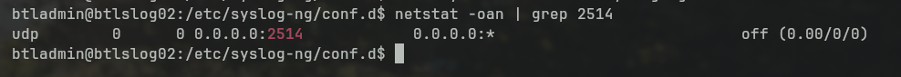{ width=600 }
/// caption
From the output of netstat, we can see that `udp/2514` is bound and should be able to receive traffic now. I don't use the term "listening" as UDP is connectionless so "bound" or "open" is a more appropriate term. 
///

## Configuring iDRAC Settings
To setup iDRAC for remote syslog, we'll have to do two things:

1. Configure the remote syslog server
2. Configure the alert and event types to be logged

### Setting Syslog Server on iDRAC

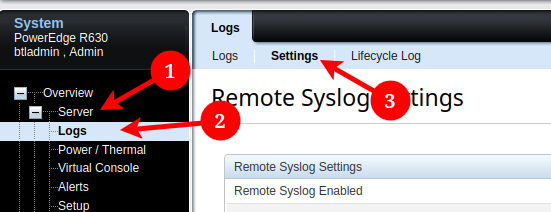{ width=600 }
/// caption
iDRAC settings can be configured by going to **"Server"** --> **"Logs"** --> **"Settings"**.
///

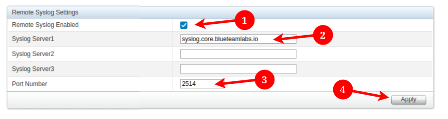{ width=600 }
/// caption
Next, we'll set our syslog server settings. First, check **"Remote Syslog Enabled"**, then set the "Syslog Server1" to your syslog server, in my instance `syslog.core.blueteamlabs.io`. 

Third, we'll set the **"Port Number"** to the one we configured on syslog-ng, `2514`. Last, we'll click **"Apply"**
///

### Configuring iDRAC System Log Types

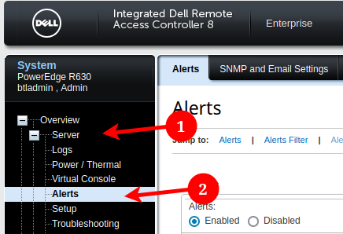{ width=600 }
/// caption
To configure this, we'll head over to the **"Server"** --> **"Alerts"** page. Here we'll be modifying the enabling Alerts and managing settings under the **"Alerts and Remote System Log Confgiguration"** settings
///


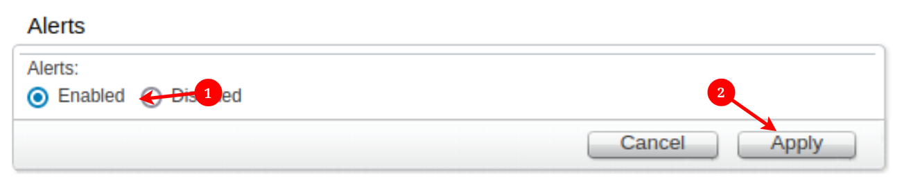{ width=600 }
/// caption
At the to of the page, if Alerts are not already enabled, go ahead and toggle that to "Enabled" and click Apply. 
///

Under the **"Alerts and Remote System Log Configuration"**, there are hundreds of event types and alerts we can configure. To simplify things, we'll just start by sending them all to our remote syslog server. 

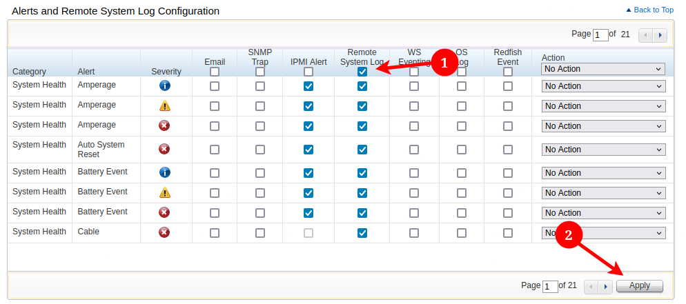{ width=600 }
/// caption
To do this, we'll just click the checkbox in the header row for **"Remote System Log"** and click **"Apply"**.
///

???+danger "Do this on EVERY Page"
    **You'll want to paginate through all the pages using the arrow buttons next to the apply button. Dell is perhaps the actual worst at UX/UI design and when you select all, it only selects all visible.**


???note "Log Verbosity"
    How verbose you want to go depends on what you're using the logs for. If you're using the for operational data, it might be helpful to have power utilization and detailed hardware logs. If you're only using them for security, you may want to limit it to audit and login events.

    I'm starting with everything and may pull things back if it's not useful.

## Verify Log Ingest
There's a coupt of methods we can use to verify log input. In my instance I want to verify two things:

1. The traffic is reaching the server over `udp/2514`
2. Syslog-ng is logging the traffic to `/syslog/udp2514.log`

### Validating Traffic is Reaching the Server
For this, we'll just run a quick `tcpdump` on the server. I know you're probably thinking *"tcpdump? I thought this was UDP?"* Well, tcpdump is just the name of the tool. Its fully capable of dumping all traffic regardless of protocol.

To do so we'll use the following command
```bash
sudo tcpdump udp port 2514
```
This just filters only traffic on UDP port `2514` as we don't want to fill our shell buffer with a ton of uninteresting traffic that we have to sift through.

What we want to do next is trigger an event that would send that data to the syslog server. We can test using the "Test Event" or we can manually do something that would trigger it. For me, I tested a few of the IDs I was able to find with a quick google search but wasn't able to get it working.

Instead, I just went over to the "Virtual Console" page and hit apply. This sent a few messages over to the syslog server.

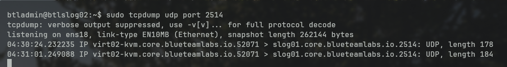{ width=600 }
/// caption
As we can see, we are receiving the logs on the syslog server. Next, we'll just need to check the logfile.
///


### Checking if the logs are Written
The next thing we'll do is check to see if the logs are written to `/syslog/udp2514.log`

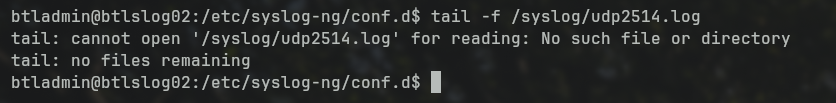{ width=600 }
/// caption
By running `tail -f /syslog/udp2514.log` we can see that theres something wrong. The file doesn't exist, which means that somethings wrong with the ingest for syslog-ng.
///

I do run uncomplicated firewall installed (UFW) on all my machines and filter all traffic except that which I have validated is required. I suspect this is getting dropped by UFW. To verify this we'll check the UFW logs.

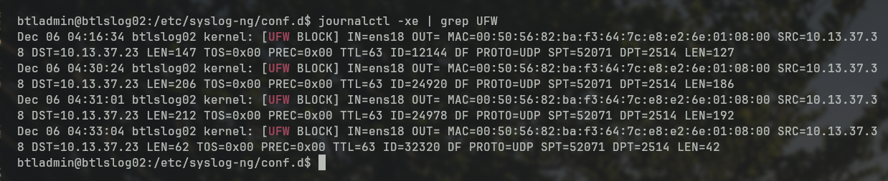{ width=600 }
/// caption
To check the UFW logs, we'll check the journal log. This can be done with `journalctl -xe | grep UFW`

As we can see from these logs, we are blocking that traffic. 
///

To add this too UFW, we'll just add the followingg rule:
```bash
sudo ufw allow from any proto udp to any port 2514
```

This just allows inbound traffic on `udp/2514` from any address. I don't get specific on UFW, just use it for managing attack service of accessible services on the local network.

Next, we'll go back and generate some syslog alerts from iDRAC again by just modifying the power configuration to "Not redundant". I would recommend waiting too run the `tail` command until after you've generated the traffic, because it will be created on first write.


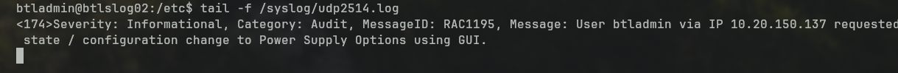{ width=600 }
/// caption
After running `tail -f /syslog/udp2514.log` again, we're seeing the logs written to disk. The next thing we'll need to do is configure the Splunk forwarder to send them.
///

???+warning "Log Format"
    What we're actually seeing here bodes well for when we create ingest actions. Things appear to be delimited in a common way that we can atleast get into a searchable index. It might not be as verbose as we would like, but it'll do.

## Configuring Splunk Forwarder
To configure the Splunk forwarder, we'll want to

1. Create the new index on our Splunk Server
2. Modify the `/opt/splunkforwarder/etc/system/local/inputs.conf` file to read the log file from syslog-ng.

???note "Splunk Deployment Server"
    You can also do some of this from the Splunk Deployment Server. I haven't got around to setting that up in the lab, and I would assume most non-enterprise users haven't either. I rely heavily on Ansible for everything in my environment, so I often don't mess with specific things like this which I can accomplish via Ansible just as easily.


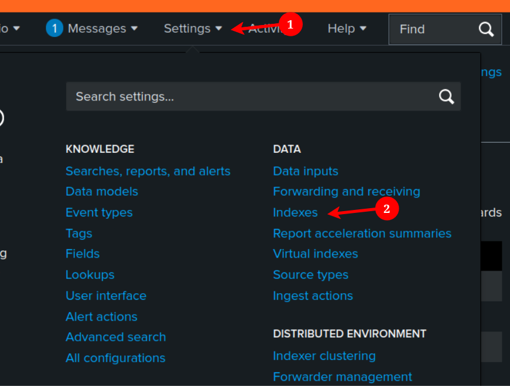{ width=600 }
/// caption
To create the index, log into Splunk and go to **"Settings"** --> **"Indexes"**
///

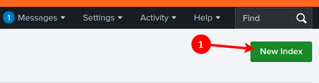{ width=600 }
/// caption
Click the button **"New Index"**
///

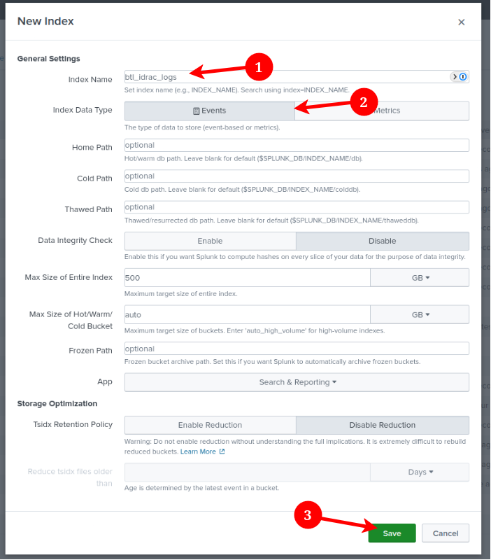{ width=600 }
/// caption
In the pop-up, enter your **"Index Name"**, in my instance `btl_idrac_logs`. Ensure that the **"Index Data Type"** is set to **"Events"**. You can optionally change any of the other settings to fit your needs, but the defaults are fine for me right now. 

Lastly, click **"Save"**.
///

With that done, heave back on over too the Splunk forwarder. For this process I think it's best that we impersonate the `splunkfwd` user as this is what the Splunk forwarder service runs under.

To do so, just type
```bash
sudo su - splunkfwd
```

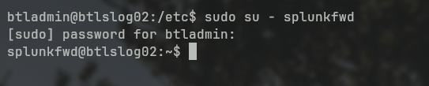
/// caption
Once you see `splunkfwd@<hostname>` you're acting as the `splunkfwd` user and can continue on. You could do this as `root` or through `sudo`, but it might cause issues with permissions, so impersonating is the best bet.
///

Next, we'll need modify the `/opt/splunkforwarder/etc/system/local/inputs.conf`. You can use your text editor of choice. To keep it accessible, I'll just use nano since not everyone knows how to exit `vi` in 2024 because they apparently have better things to do.

```bash
nano etc/system/local/inputs.conf
```

At the top of your file, add a new section for the log file we are writing with syslog-ng. Here is what mine will look like.
```
[monitor:///syslog/udp2514.log]
sourcetype = dell:log
index = btl_idrac_logs
```
When we set this, we're telling it to monitor for `/syslog/udp2514.log` file entries, via the `[[monitor://]]` section. We're then telling Splunk to index these in `btl_idrac_logs` via the `index` key. To aid in finding the logs, we're also telling it to set the sourcetype as `dell:log` via the `sourcetype` key. 

Save the file using ++ctrl+x++ and hit ++y++ when it asks you to save. Lastly, hit ++enter++ to confirm and close the file.

Next, we'll need too restart the `splunkd` daemon. To do this just run 
`bin/splunk restart`

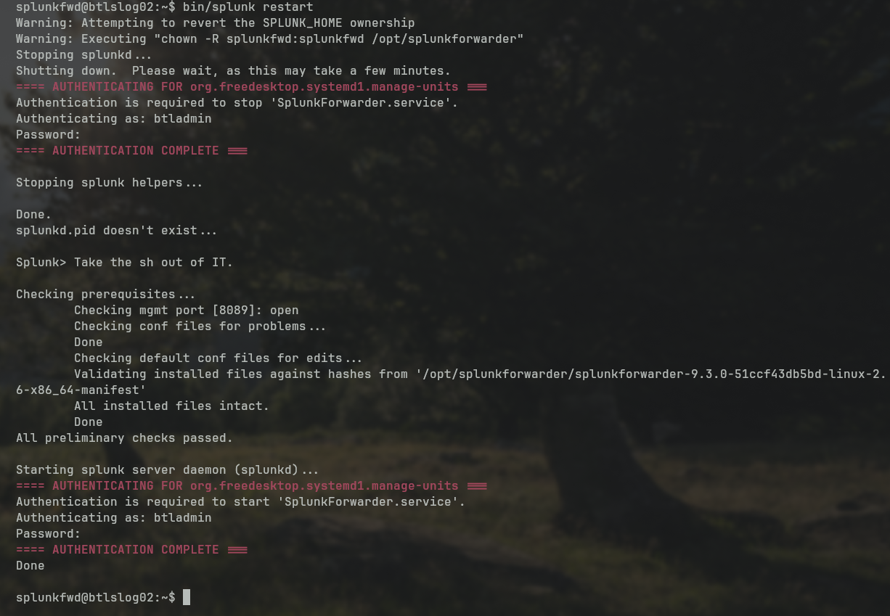{ width=600 }
/// caption
It'll ask you for a `sudo` password a few times, and restart when complete. Your logs should now be getting sent to your Splunk server.
///


## Verifying Logs in Splunk
Lastly, we'll verify our logs are actually being indexed. We won't cover creating any ingest actions or extractions in this post, I'll save that for another more complex one with a greater learning opporitunity. 

???+warning "Generate Logs"
    What you'll want to do next is go generate some events in your iDRAC controller as Splunk won't ingest whatever exists when you add it to the monitor. You'll need some new events for it to pull in.


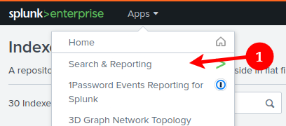{ width=500 }
/// caption
Login to your Splunk search head and go to **"Search and Reporting"**.
///

In the search bar, enter the query `index="btl_idrac_logs" sourcetype="dell:log"`. Obviously change the index name if you selected something different.

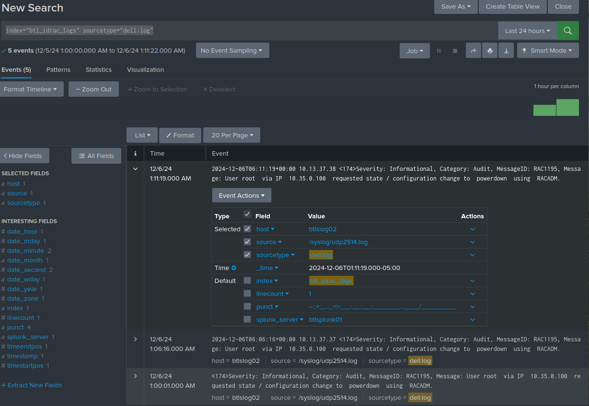{ width=600 }
/// caption
If all goes well, you should see some logs in there. You'll see the colon-delimited fields aren't indexed indivudally. You'll have to create extractions for that, but I won't cover that in this post as it's already long enough and it's easy to ask ChatJipitee. 
///

???+success "Congrats!"
    Congrats, you just ingested more logs in your hunt to become the next large surveillance provider. You're making our frenemies over at the NSA, NRO, DIA, and CIA very happy! 

