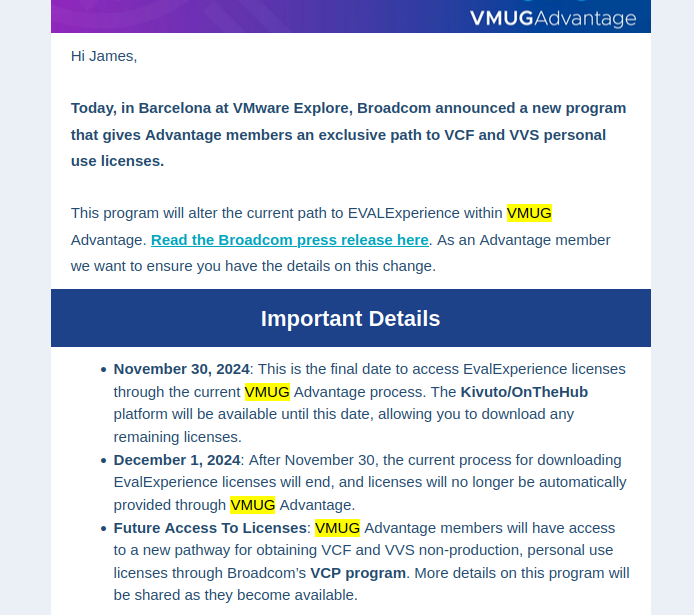
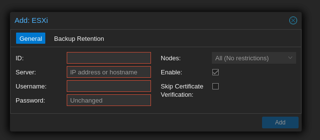

# Lab Update - Off with VMware

The Broadcom takeover of VMware saga continues. This time, changes to licensing for VMware User Group (VMUG) Advantage members.

For years, I've been using VMUG Advantage to handle my lab licensing. It's a yearly membership that **granted** you access to "EvalExperience" licenses for the full suite of VMware products that were good for 365 days.

VMUG also provides some additional benefits like discounts on exams, free training, user conferences, and more. For me though, the licensing was the main driver of my membership.

Despite constant reassurance from the VMUG and VMware leadership that nothing would change for us, our license experience has completely changed.
<!-- more -->
## What Changed?
Gatekeeping of Eval Licensing. That's the best I can explain it.

On Nov 5, VMUG members received notice that VMware was changing the way Eval licensing was provided. This change was abrupt, one which we were assured would not occur, and a continuation of the cannibalistic behavior of Broadcom in their quest to maximize profit over at VMware after the acquisition.

In short, EvalExperience licenses are no longer a thing. Rather, you now need to get certified to get access to VMware licenses for personal use.

{ width=600 }
/// caption
VMUG Advantage membership email with details of licensing changes.
///

With the change, we learned:

* If we needed to request any licenses, we would have to do so prior to Nov 30, which would be valid for 365 days.
* We could only download existing licenses and software prior to December 1.
* No details of how this new certification program works.

I just want to vent for one damn minute. I understand this is a venture in expanding the profitability of VMware. Certifications bring in money, but how on God's green earth are new users supposed to learn the product and become confident enough to administer and get certified in the software if they can't even get access to eval licenses that are valid for longer than a few weeks? It fails basic logic tests, but we rejoice in the only responsibility executives have being to their shareholders. Lobotomize the customer base, push everyone who's loved the product away—as long as our profit margins are increased—who gives a damn?

## The Alternatives 
I'm not going to pretend I didn't anticipate this. I've been anticipating this since the moment the acquisition went through. Broadcom has a long history of doing everything possible to make the customer experience worse on their path to maximize profit.

Thankfully, I've been researching and evaluating alternatives for the last 3-4 months. Even though we were assured this would not change, and some made renewal or purchasing decisions based on this commitment, I knew deep down it was only a matter of time.

The main alternatives I've been looking at are:
* Proxmox Virtual Environment
* XCP-ng
* Hyper-V
* Azure Local

### Ruling Things Out
##### Hyper-V
I've used Hyper-V in the past, and if I'm quite honest I want nothing to do with Windows or Microsoft. Hyper-V has some basic feature sets you'd expect from a hypervisor and does have a decent management interface. 

One of the biggest problems for me was Microsoft discontinuing Hyper-V standalone server. I do not want my hypervisor to have to run a full-blown Windows environment (even if it's only Server Core). 

Windows is a security nightmare, and I do not want to have to manage migration, high availability, and rebooting servers monthly (or more). I need these things to be resilient, sparingly need rebooting, and be minimal from the start. Hyper-V on Windows is not that.

***On top of security, Microsoft is quickly becoming the most privacy-invasive company to ever exist.***

They've continued to add telemetry which can never fully be blocked or ripped out of their software, locked functionality behind cloud connectivity requirements, and are most certainly best friends with three-letter agencies.

##### XCP-ng
[XCP-ng](https://xcp-ng.org/) is built on the Xen hypervisor. Of the ones I elected not to use, this was the one I kept coming back to and thinking "maybe I should try it out." 

To be completely honest, there wasn't a whole lot to dislike with it. It met all of my requirements, had a centralized management interface, and is built on proven tech. 

***Just one glaring issue. I've never used it before.***

Coming from VMware which I've used since the earliest days of my professional career, I want something that's familiar or that I've at least worked with extensively.

Of course, I'm always for learning, but this lab also hosts critical home services like personal file storage for myself and family, ISOs of course, GitLab, ad-blocking, SSO, and more. I try to keep these things as available as possible, and I probably have better uptime than most small-medium enterprises. 

Not entirely difficult when I'm not supporting thousands of users, but still something I always find entertaining.
*Companies spend all this money for high availability and scalability but end up having more downtime and performance issues than if they just went with a single instance armed to the teeth with sufficient resources.*

##### Azure Local
This is actually the one I'm most interested in. I love the idea of having self-hosted bare-metal that integrates tightly with public cloud features. 

For those who don't know, [Azure Local](https://azure.microsoft.com/en-us/products/local/) is basically a way of bridging the gap and allowing you to have hybrid-cloud resources in your Microsoft Azure tenant. This significantly reduces the cost you would pay for running VMs in Azure and integrates neatly with a wide array of features, including Azure Kubernetes Service (AKS). 

While I've consciously elected to avoid cloud resources and SaaS applications for the homelab, I would love to get more experience with Azure Local. The Systems Engineering team at work is currently doing a proof-of-value in it, as they also look to move away from VMware.

***P.S. this used to be called "Azure Stack."***

Three issues resulted in me not giving this one the light of day:

* Cost
    * $10/Physical Core per month...
    * I have 44 physical cores. That's $440/month...
    * It is $0/Physical core for Azure Hybrid, but I don't think I could qualify for that benefit.
* Requirements that all hardware (storage, networking, CPU, RAM) are identical. 
    * I've got a hodgepodge of equipment for my lab.
* The cloud. 
    * I can't stand it for handling my personal data.

### Landing on Proxmox
Proxmox is the only other hypervisor besides Hyper-V and VMware that I've used extensively. I used it all the way back before I realized VMUG EvalExperience was a thing about 3 years ago. 

Proxmox is everything you could ask for in a hypervisor, supporting nearly identical feature sets to VMware. 

While I won't be able to afford a subscription, which is a shame because I would love to support the product, I can still get updates and packages through their non-production repo. This is fine, after all, this is a homelab.

##### Ludus, our cyber-lord and savior.
There's also one other benefit that I haven't discussed yet. For the lab, I use something called [Ludus](https://gitlab.com/badsectorlabs/ludus). 

Ludus is a really awesome platform for quickly spinning up and shutting down cyber-ranges. Previously it was maintained by CISA, but has since been forked and maintained by Bad Sector Labs. CISA has archived their official Github repo for it.

Ludus itself utilizes Proxmox. Ludus can be installed in one of a few ways:

* [In a nested Debian 12 VM](https://docs.ludus.cloud/docs/deployment-options/bare-metal)
    * This is what I've been using
    * Performance is sub-optimal when working with large labs
    * Nested virtualization is a pain
* [On bare-metal as a Debian 12 Machine](https://docs.ludus.cloud/docs/deployment-options/bare-metal)
    * It ends up running Proxmox anyway
* [On an existing Proxmox instance](https://docs.ludus.cloud/docs/deployment-options/proxmox)

For me, I prefer running it on my existing Proxmox instance. Sure, it's not their recommended method and might cause other issues, but I also don't want to hassle with nested virtualization or dedicated one of my physical servers to Ludus and Ludus alone.

##### Built on Debian
On top of Ludus support, it's built on Debian. This means I can customize and harden it to my hearts desire.

I've used Linux since I was 14, and it's the one operating system I'm most comfortable with. 

Knowing it's built on this gives me the confidence I need to run with it. I'll be able to apply all my standard security controls, troubleshoot, and get things back up and running in the event of downtime.

## Migration Post Mortem
Migration was alot easier than I thought it would be. Proxmox has added some good features anticipating a surge of new customers after the VMWare saga began.

### Migration Times
Migration took about 72-hours in total. This was largely because I did it in batches, if I did it all in one session it probably would have taken 12-hours or less for cloning all the VMs. In total I migrated around 30 VMs off of 4 separate VMWare hosts totalling over 8TB in used disk space.

Much of the transfer time can be attributed to my miniature lab machines. These are the ones that are powered-on and operational 24/7 and run core services that my network could not operate without. 

These machines are HP ProDesk 600 G5 Minis which only have 1x1Gbe link. This is sufficient for daily use and while I do intend to upgrade these to something more modern and capable of MGig transfers, I'm happy with them for now.

On my machines with 10Gig links, that was fairly fast. Those VMs (also some of the largest ones) migrated within 6 hours.

### Networking Pains
The main pain after migration was the networking configuration on the VMs themself after migrating. 

I'm not sure if I selected the wrong option when migrating them, but the NIC Alias within the operating system changed on every single system.

On my Windows boxes, it went from `Ethernet0`, to `Ethernet1`. 

On my Linux boxes, they went from `ens160` and `ens192` to `ens18` and `ens19`.

This was ***painful***. I initially just booted up these machines hoping things would work, only to discover I'd have to manually console into every single one and update the network interface configuration. 

This was most painful when it came to my Domain Controllers, as when I initially updated the adapter settings, I forgot to set the DNS. This took me about a week of intermittent issues and DNS resolution issues before I figured it out.

Once I got everything moved over to the new aliases though, everything worked fine. Had I known before hand that it would do this, or of a way to prevent this, it would have went alot smoother.

### The import Process
In Proxmox, migrating from VMWare is fairly simple. You just attach your ESXi instances, browse their inventory in the storage app, and click Import.

{ width=600 }
/// caption
Screenshot of process of adding ESXi Host as storage
///

I did have to manually export one VM. For some bizarre reason it would not import my Plex VM. I think it had something to do with mappings to passed-through PCIE devices. 

I did remove them from the VM config in VMWare, but it still gave errors after that and I instead just exported the VM and imported it manually.

This import was as simple as copying the disks over to the proxmox host and attaching it to a new VM and booting things up for them to work perfectly.

The whole process of that is:

* Export the VM from VMWare
* Copy the disks over to Proxmox
* Create a new VM in Proxmox and take note of the VMID
* Import the disk and associate it with the new VM
    * For me this was as simple as

        ```qm disk import 121 Plex/BTLPLEX01-1.vmdk iscsi-vol1  --format vmdk```

* Modify the configuration file of the VM to mount the disk
    * The config file would be located at: 
        
        ```/etc/pve/nodes/<node-name>/qemu-server/<vmid>.conf```

    * You would see a line for "unused1", simply switch this to "scsi1" (or ide1/sata1 depending on your disk controller) and append the size.
    * Add scsi1 or ide1/sata1 to the boot order
    * Set scsi0 or ide0/sata0 to unused1 and remove the size
    
        Example from my lab:

        ```
        boot: order=scsi1;ide2;net0
        cores: 4
        cpu: x86-64-v2-AES
        ide2: none,media=cdrom
        memory: 32768
        meta: creation-qemu=8.1.5,ctime=1732976942
        name: BTLPLEX01
        net0: virtio=BC:24:11:67:98:DD,bridge=vmbr1,mtu=9000,tag=10
        net1: virtio=BC:24:11:21:F1:69,bridge=vmbr1,mtu=9000,tag=900
        numa: 0
        ostype: l26
        scsi1: iscsi-vol1:vm-121-disk-1,size=175G
        scsihw: virtio-scsi-single
        smbios1: uuid=d01b1f98-1a58-4b31-8662-4a9f976a192f
        sockets: 1
        unused1: iscsi-vol1:vm-121-disk-0
        vmgenid: 2978ba0c-4eee-4d0a-b577-a3bbcb135ad0
        ```
    *In case you're wondering, my Plex machine does not store the ISOs locally, they're mounted via a network share. Hence the only 175G drive (which is more than I really need)*

### I'd like to see:
Just a few things I'd like to see with Proxmox. Nothing that's a deal breaker or something I wouldn't recommend it over, they're more just nitpicking, personal preferences, and overall thoughts on the user experience.

* **SAML Support for Login**
    * I use Duo for access to all lab resources
    * The trust relationship for SAML is not implicit, unlike OIDC.
    * Permissions mapping for OIDC is also not great...Manually? Really?
    * SAML is the defacto enterprise standard for SSO, just add support please.
* **Importing from vCenter Inventory**
    * Rather than adding each individual ESXi host, add a vCenter server.
    * This would be ideal for enterprises migrating over.
    * Admittedly, this might already exist, I just didn't try it because it wasn't clear it was supported.
* **A host-profile/compliance equivalent**
    * This was a feature I used heavily
    * This would give the ability for us to quickly ensure that all hosts have matching configurations
* **Standard tcp/443 for HTTPS**
    * Okay, this is more of a nitpick.
    * I can't stand having to bookmark/type :8006 at the end of ever host URL
* **A Simpler "Distributed Switch" alternative**
    * VMWare Distributed Switches are insanely easy to create and intuitive
    * SDN seems like it can provide this functionality, but is not as clear or intuitive.

### Overall Thoughts
Overall, it was a ***relatively*** painless experience. The issues I dealt with were trivial, and likely my own doing.

I would say for a large enterprise, this might be a little cumbersome and would definitely require some white-glove support or someone who can automate alot of this work.

Clustering is working as expected, I didn't have any issues joining machines to a cluster and can centrally access all instances from any of the machines, which is a plus. No need for a dedicated vCenter management appliance that if I turn off, I'm stuck having to manually manage each instance. 

I will miss the host-profiles and distributed switching though. Not even touching on more advanced features, those were some of the ones I relied heavily on to simply things.

I'm super excited to see Proxmox continue to adapt and get new features as organizations look for alternatives to VMWare. They've come a long way since I first started with them back in 2016.
