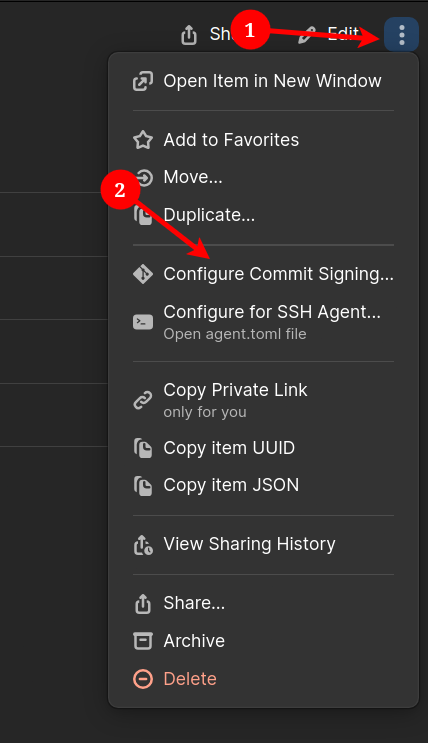
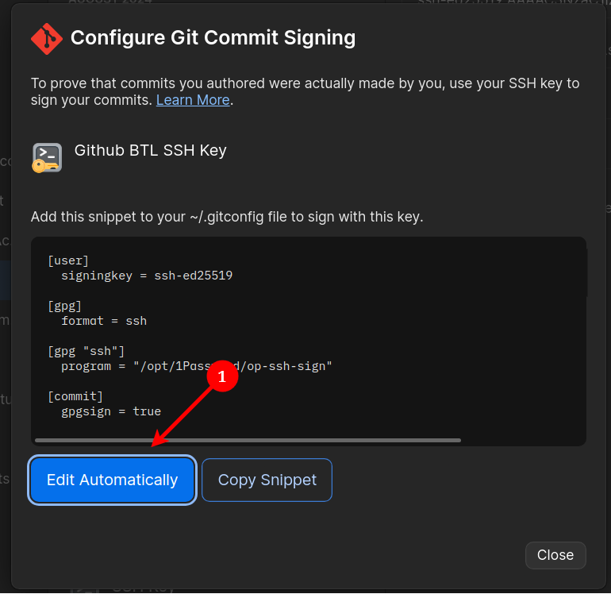

# Signing Git Commits with 1Password SSH Agent
This is a quick post because I left it out of my last post on using the 1Password SSH agent in general. Simple oversight, but something I wanted to touch on real quick.

1Password allows you to configure your SSH keys for Git signing. This means that you can cryptographically validate the source of commits. This is obviously desirable for a number of reasons.

<!-- more -->

## Enabling 1Password Git Signing
To do so, you'll want to find the SSH key you're utilizing for git commit signing. Presumably, you've already set this up in Github.

{width=500}
/// caption
In 1Password, locate the key and hit the **"Burger"** icon, next click **"Configure Commit Signing..."**.
///

{ width=500 }
{width=500}
/// caption
A pop up window will appear, you can hit **"Edit Automatically"**. If it was successful, you should get a message telling you so, if not, you will have to manually edit your `~/.gitconfig` file.
///

???+success "That was Easy"
    **That was all it took and you're all set, maybe you're unfortunate and had to manually edit `~/.gitconfig`, but even that is easy enough. Next time you commit and push, your commit will be signed!**