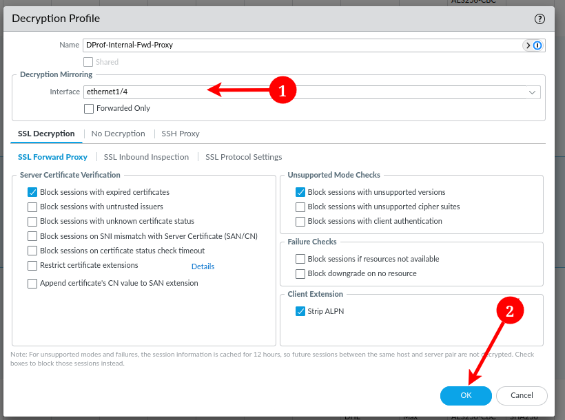

# PAN-OS Decryption Port Mirror - Part 1 - Why and How 
Okay, so. Decrypting traffic. Something unpopular. Purposely breaking decryption and secrecy. When would we ever want to do that?

Well...for an enterprise, the answer is nearly always. At some point after encryption gained true popularity and adoption for legitimate activity, attackers took note and started using encrypted channels to deliver payloads and communicate with C2 frameworks. To noones surprise, the tools we use everyday to defend data, systems, and networks, are the same ones our adversaries are using to attack us. 
<!-- more -->

SSL Decryption (otherwise called SSL Inspection) is supported on nearly all modern enterprise grade firewall solutions. With advancements in compute power and packet processing technologies, it is very rare that a dedicated appliance is needed for SSL Decryption.

While this solves one problem of needing a separate appliance, it creates another. The Decryption is often a black box where we don't get any advanced ability to determine what's happening, and are stuck relying on vendor content updates for signatures and behaviors. 

In a world where signature based detections are dead, we need the ability to threat hunt. The ability to threat hunt all aspects of data in our environment. It's useful for detection engineering, incident response, DLP, and insider threat management.

Plus, this is my lab, I have free reign since it's all my own data, so why not.
## A Word of Caution
Whether you're able to decrypt your users traffic is highly dependent on the jurisdiction you reside in. In some countries, provinces (states for us 'Mericans), and localities, we may be severely limited by the law in what we're able to decrypt.

In the U.S. decryption of traffic on enterprise networks and assets is generally permitted. There are obvious exceptions to what traffic can be decrypted, but as long as you're taking the proper precautions, getting approval from legal council and management, complying with the law, and excluding obvious violations, you'll be okay.

### What are Some Common Exclusions?
In the United States, there are certain types of privileged communications or communications that would result in certain regulatory frameworks being applicable if collected.

1. Attorney-Client privileged data.
2. Financial data, including credit-card transaction data.
3. Personal health information.
4. Law Enforcement communications and data, including CJIS controlled materials.
5. Military communications and data. 
6. Government communications and data; think accessing anything with a .gov.

These are just the starting point of things to always exclude from decryption. Depending on your organizations leadership, legal guidance, and organization policy, you may be further restricted. Do not implement decryption without buy-in from leadership and policy to back your actions.

???+warning "Once More for the People in the Back"
    In the United States, we have broad discretion over organization owned data and equipment, and theres often a clause in the user agreement policy that clearly states that by using the organizations information systems, you consent to being monitored and that any and all activities are monitored for security and compliance with the policy. 

    If you're in need of a policy that covers you, you can start with the [SANS policy templates](https://www.sans.org/information-security-policy/?page=3), specifically the "Employee Internet Use Monitoring and Filtering Policy".

    This usually covers us from a policy and legal standpoint, as long as we're making best-effort to comply with all guidance from our legal team and regulatory frameworks that might apply. Again. Do not proceed without prior approval from leadership and legal teams.

## What's Needed for Decryption
We won't cover it in depth in this scenario, but you would generally need:

### A Trusted Certificate Authority
* A CA with private key installed on the firewall, whose public key is in the trusted certificate store of all endpoints in scope for decryption.

This is referred to as the "Forward Trust Certificate" This certificate is used to decrypt sessions with a valid certificate issued by a trusted CA.

In an ideal scenario, you already have an enterprise PKI in place and have a Trusted Root CA that can issue a Subordinate CA certificate that the firewall can use. Best practice dictates that the Root CA should never issue end-entity certificates, so the firewall should also adhere to that same practice. 

This practice allows us to limit the exposure of our Root CA. We don't want to over-expose it, only to have it be compromised and to have to rebuild our entire PKI. There are numerous other concerns but with a tiered PKI, we can alleviate alot of this risk and can easily revoke a Subordinate CA and issue a new certificate if it's ever compromised.

### An Untrusted Certificate Authority
A CA with private key installed on the firewall, whose public key is ***NOT*** in the trusted certificate store of all endpoints in scope for decrypton. 

This is referred to as the "Forward Untrust Certificate". It is used for decrypting sessions where the servers certificate is expired, revoked, or not issued by a trusted certificate authority. The intent is to provide the same experience where a user would have to accept the certificate warning to access.  

The "Forward Untrust CA" is often generated directly on the Firewall for simplicity, and never exported as to never accidentally be installed and trusted by endpoints.

### Policies for What to Decrypt
After you've got those two requirements, you just need to set-up some Decryption Profiles and Deploy some Decryption Policies. These are just like standard security policies, and are how we can dictate which traffic to decrypt, and which to ignore. 

???+info "Assumptions"
    For the remainder of this post, we're going to assume you know how the decryption works, maybe have it deployed or have worked with it before, and don't need handholding on the fundamentals of it. 
    
    It's a simple concept. We intercept the web request, and impersonate the client. This allows the firewall to securely communicate with the cloud and see the data in plain text. The firewall will then relay this traffic back to the client, signed by our internal CA. Hope that clears up any further questions. 

## Decryption Port Mirror
Once we're decrypting data on our Palo Alto, we have the option to activate a "Decryption POrt Mirror" feature. This feature does exactly what it sounds like, and mirrors all decrypted traffic out a designated port.

This allows us to analyze the traffic further, do behavior analytics, insider risk management, build new threat signatures, and threat hunt on our encrypted sessions.

## Where Might we Send it?
Where you send your decrypted traffic is totally up to what your organization has in store in terms of network analytics. Some organizations might use something like a Gigamon, while others might choose to send it to a custom built solution that can scrape sensitive data like passwords, PII, and other protected information.

It's highly dependent on what you're using the data for, how long you need to maintain it, what level of verbosity is required, and what you're comfortable with from a security perspective.

## Activating the Port Mirror License
For this to work, we'll have to log into our PANW Support Portal and activate the feature license for "Decryption Port Mirror". Palo does not automatically enable this license, but it is available as a perpetual license for all devices that support it. VM-series firewalls do not support port-mirror.

The reason for this is the legal complications behind this. Since this is a lab device and noones going to be snitching on me but myself, we're all set to decrypt and index whatever the heck we damn well please.

{ width=500 }
/// caption
First, login to the Support Portal. Navigate to **"Products" --> "Devices"**. Find the device in question and hit the **"Edit"** button.
///

{ width=500 }
/// caption
In the pop-up, click on "Activate Feature License", and select the "Decryption Port Mirror License".

You will be prompted to accept a legal agreement. Again, this is where you need to use caution and make sure you're legally in the clear to do so. You'll also receive a legal notice via email noting that PANW is not claiming any responsibility for your actions and it's on you to make sure company complies with applicable laws and regulations.

Accept the prompt and click "Agree and Submit".
///

{ width=500 }
/// caption
Next, on the Firewall, go to "Device" --> "Licenses". In the license window, click "Retrieve license Keys from license server". If your device is air-gapped, you'll have to manually download the license from the portal.
///

{ width=400 }
/// caption
A loading screen will popup. Once retrieved, you'll have to reboot the device to apply. You can do this by clicking the "Reboot Device to activate" link, or go to "Device" --> "Setup" --> "Operations" and "Reboot Device". 
///

## Configuring Port Mirror

/// caption
On the firewall, head over to "Network" --> "Interfaces" --> "Ethernet".
///

/// caption
Find the interface you want to use as a mirror interface and edit it. In the "Interface Type" field, select "Decrypt Mirror" and click "OK"
///

/// caption
We'll then need to configure our decryption profiles and tell them where to forward traffic.
To do this, go to "Objects" --> "Decryption Profiles".
///

/// caption
On each profile we want to forward, we need to set the interface to `ethernet1/4`. Set this and click "OK".
///
???note "Forwarded Only"
    Forwarded Only is used to filter out traffic that is dropped by the firewall. There might be some security value in seeing dropped traffic. Perhaps the firewall is dropping malicious traffic and we want to look into the decrypted content for threat-hunting. In this case, we'd leave it unchecked.

    If we had concerns that this would overwhelm us and make the data unsearchable, we'd check the box so only forwarded traffic is included in the port mirror. 

Lastly, before committing, we need to enable forwarding of decrypted content. This is a device/vsys level setting that acts as a sort of failsafe and enables us to quickly turn it off/on again globally instead of having to make multiple config changes.

I have a multiple vsys setup, so this would be slightly different for those with the default vsys only. You would instead access this setting via "Device" --> "Setup" --> "Content-ID" where there'd be a checkbox to enable it.

/// caption
On a multiple vsys deployment, navigate to "Device" --> "Virtual Systems" and open the vsys you'd like to enable decryption forwarding for. In my instance, `vsys1/main`
/// 

/// caption
In the pop-up, check the box for "Allow forwarding of decrypted content" and click "OK". Do this for each vsys you want to enable decrypted content forwarding for.
///

/// caption
Click "Commit" to save the changes.
///

## Up Next: Splunk Stream
Now that you've applied the licensed, rebooted, and verified Decryption Port Mirror is active, we'll go ahead and configure Splunk. We'll have some work to come back to on the Firewall, but to make this easier to digest, we'll split it into multiple parts.

* Part 1 - Activating Port Mirror and Why
* Part 2 - Configuring Splunk and Splunk Stream
* Part 3 - Using Splunk Stream for Threat Hunting
