# Duo SSO for Proxmox
I recently migrated away from VMWare, and over to Proxmox. As part of this migration, I wanted to setup auth similar to what I had with vCenter.

Thankfully, Proxmox supported Open-ID Connect (OIDC). This is a simple guide to follow, without much fluff.

<!-- more -->
## Create the Application in Duo
***First, login to your [Duo admin portal](https://admin.duo.com)***

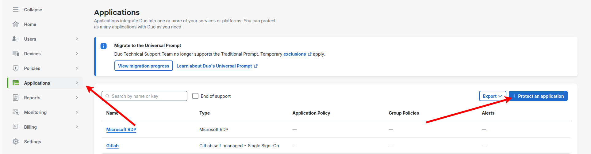{ width=600 }
/// caption
Go to the **"Applications"** and click *"Protect and Application"*.
///

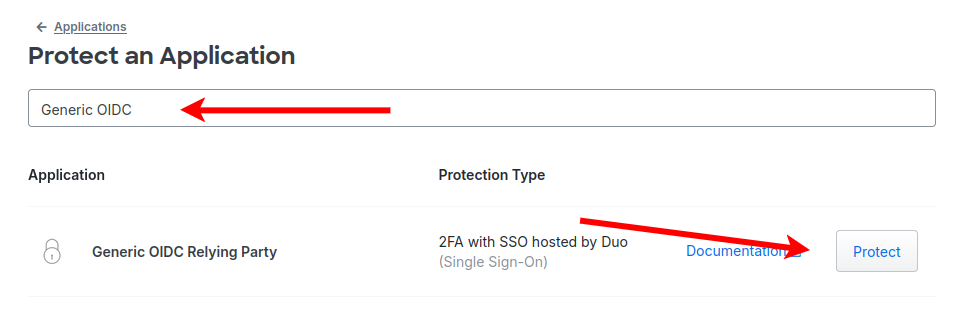{ width=600 }
/// caption
Search for **"Generic OIDC"** and click **"Protect"** on **"Generic OIDC Relaying Party"**.
///

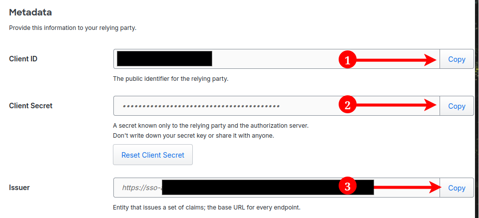{ width=600 }
/// caption
Copy your **Client ID, Client Secret, and Issuer URL** to a text file momentarily. You can alternatively just come back to these when we get to that point on Proxmox.
/// 

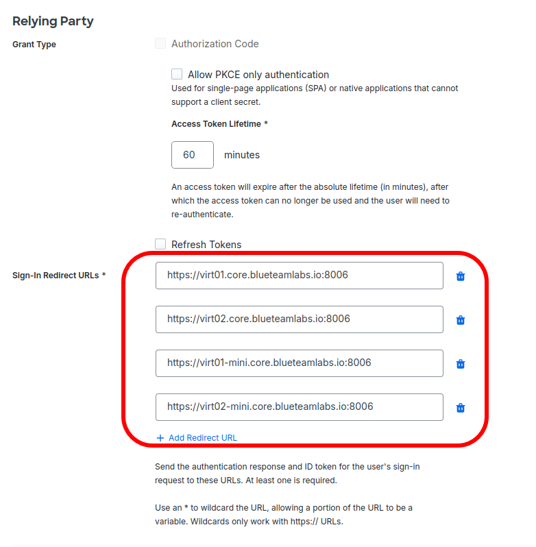{ width=600 }
/// caption
Scroll down until you find **"Sign-In Redirect URLs"**. Here, add the URL for ***all*** of the Proxmox instances you want to be able to login with OIDC on.

These should be in **`https://<fqdn>:8006`** format.
///

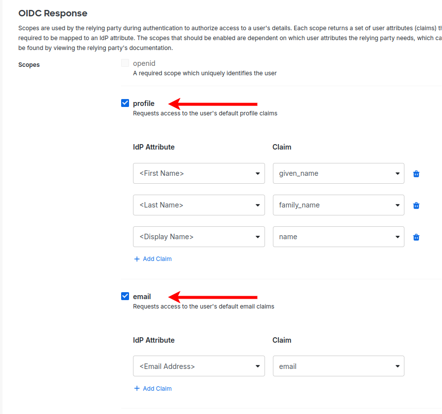{ width=600 }
/// caption
Scroll down to OIDC Response, and check the boxes for **"profile"** and **"email"** under **"Scopes"**.
///

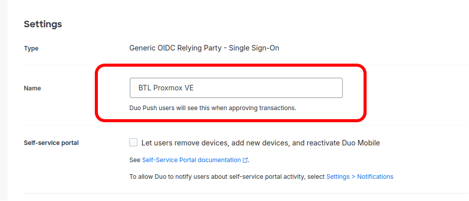{ width=600 }
/// caption
Next, scroll down and give it a **name**.
///

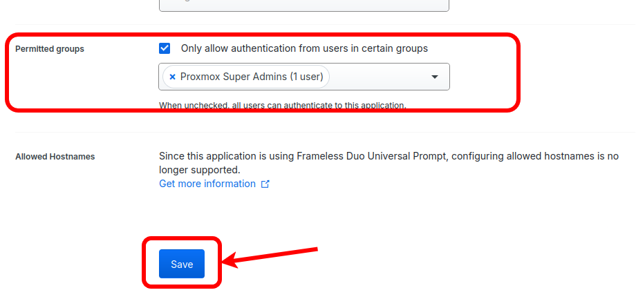{ width=600 }
/// caption
I would ***highly recommend*** restricting this to a specific group of users that can authenticate to this app. For myself, I'm using the group **`Proxmox Super Admins`**. ***Lastly, click "Save"***
///

???+warning
    Please be sure to click save. If you don't click save the Application isn't created and you won't be able to use it.

## Register OIDC Realm in Proxmox
***Login to your Proxmox server.***

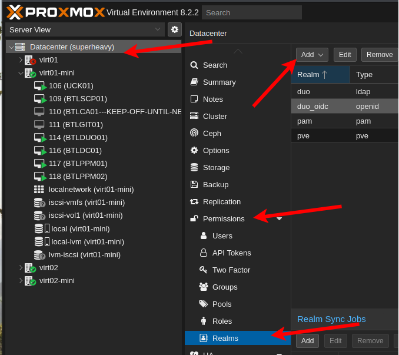{ width=600 }
/// caption
Select the **"Datacenter"** and locate the **"Permissions"** section and expand it. Next, go to **"Realms"** and click **Add**. In the drop-down, select **"Open ID Connect Server"**.
///

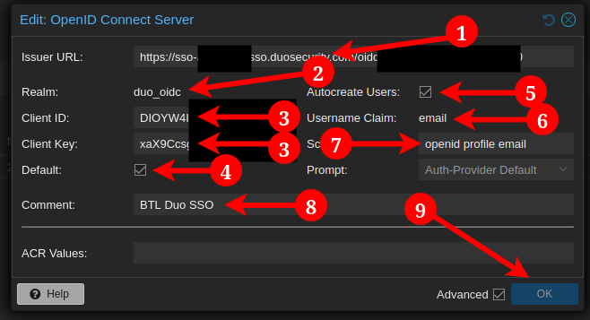{ width=600 }
/// caption
Enter the Issuer URL we copied earlier. You can revisit your application in Duo if needed.

Under **"Realm:"** give it a name. For me, I selected `duo_oidc`

Enter the **Client ID** and **Client Key** we copied earlier. Reference your Duo application if required.

Check **"Default:"** if you want this to be the default login method.

Check **"Autocreate Users:"** *if you want--you* do still have too provision permissions manually.

For the **"Username Claim:"** Select **"email"**

For **"Scopes:"** enter `openid profile email`

In **"Comment:"**, enter a friendly name that'll be displayed when logging in. I chose `BTL Duo SSO`.

Click **"OK"** to save.
///

## Create a Group, Assigning Permissions, and Adding the User

### Create the Group
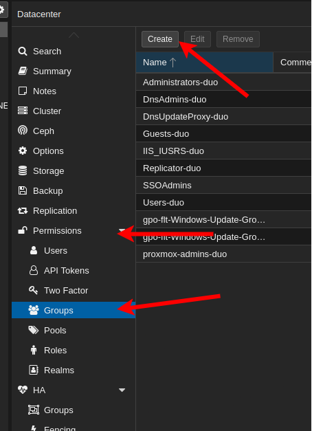{ width=600 }
/// caption
Select the **"Datacenter"** and locate the **"Permissions"** section and expand it. Next, go to **"Groups"** and click **Create**.
///

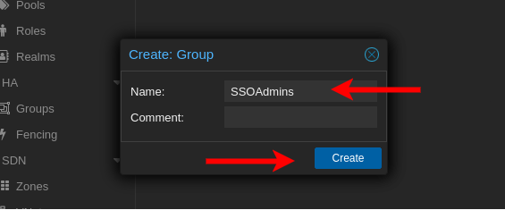{ width=600 }
/// caption
In the popup, enter a name for the group. This is the group we're using to control permissions for SSO users.

I selected **`SSOAdmins`**. Click **"Create"** to save.
///

### Assign Permissions
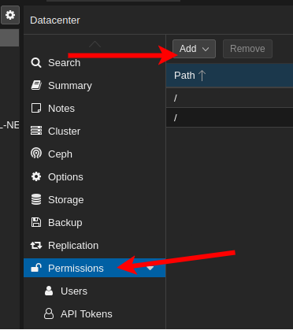{ width=600 }
/// caption
Click on **"Permissions"** and click **"Add"**. Select **"Group Permissions"** from the drop-down.
///

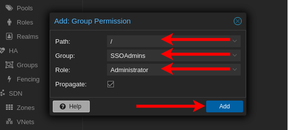{ width=600 }
/// caption
Select **`/`** as the Path. This will provide full permissions for the entire datacenter.

Next, select the **Group** we created earlier, **`SSOAdmins`**

For role, select **"Administrator"** and click **"Add"** to save.
///

### Pre-Create our First User
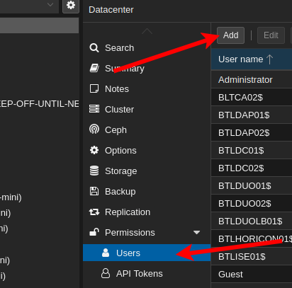{ width=600 }
/// caption
Click on **"Permissions"**, locate **"Users"** and click **"Add"**. 
///

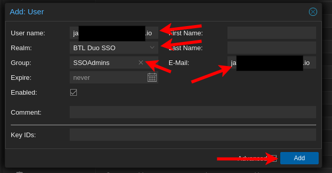{ width=600 }
/// caption
Enter the **email** as the username. For **Realm** Select the OIDC realm we created earlier, **`BTL Duo SSO`**. 

For the **"Group"**, enter the group name we created earlier, **`SSOAdmins`** Lastly, enter the email again in the **"E-Mail"** field and click **"Add"**
///

???+note Manual Permissions
    Unless I'm missing something, which I might be, you will need to manually add users to groups even when they're auto-created. I'm not sure of a way to add users to groups dynamically through OIDC, though I do imagine there is some possibility of it.

    This step saves us a step of having to logout, log back in as root, assign permissions, logout, and log back in as our SSO user to test things again.
## Testing Login

***Logout or open a private-browsing Window and open your Proxmox Server***

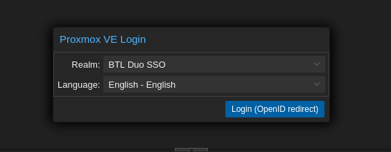{width=600}
/// caption
On the login page, if you didn't select the new Realm as default, select it from the drop-down and click **"Login (OpenID redirect)"**
///

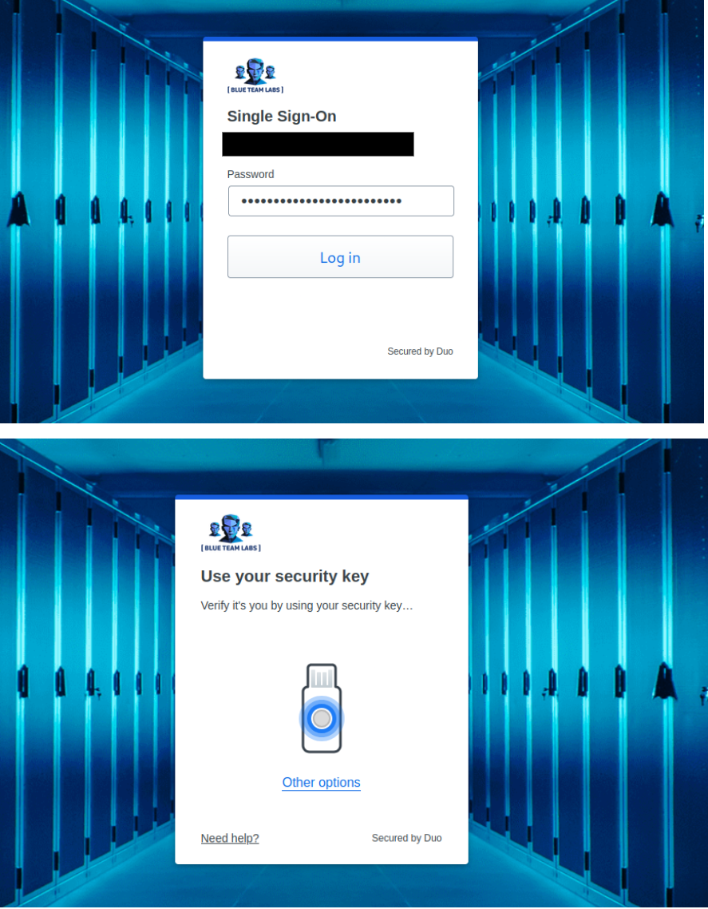{width=600}
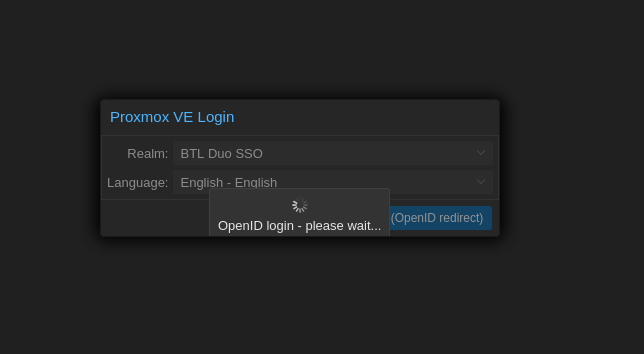{width=600 }
/// caption
Follow the login flow for Duo that you have configured.

At the end, you'll see a brief loading window before being thrown to the main Proxmox UI.
///

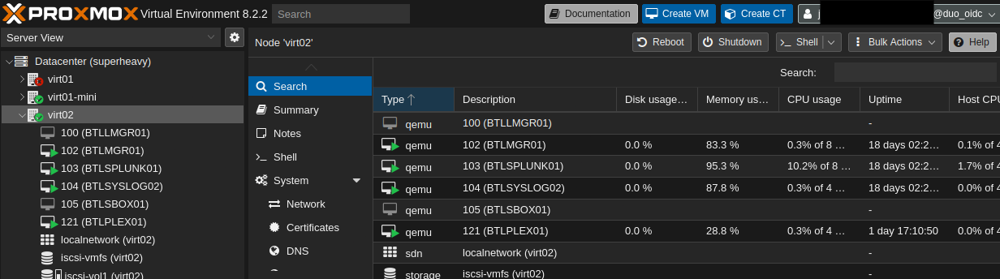
/// caption
After login, expand some of the panes and validate your permissions loaded properly. If you are able to see everything you can as your non-SSO user, you should be all set.
///

## Thoughts on Permissions
I played around with custom claims and different ways of creating users and what I found is that the only way to assign a user permissions is to manually assign them. Some quick SearXNG searches and combing through reddit threads confirmed this as well, I would imagine its possible somehow, but I haven't figured it out, and noone else has either; atleast not that they've shared.

I guess we're just stuck having to manually assign users to groups--atleast it auto-creates the users for us though.